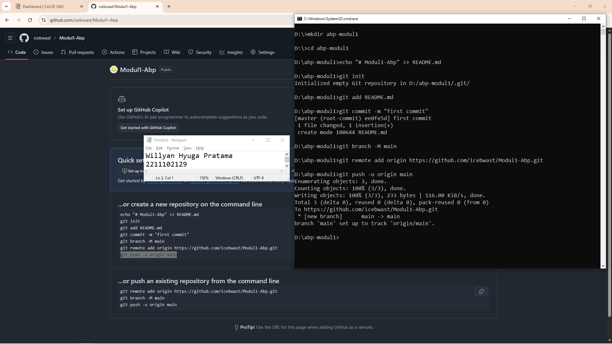

# Aplikasi Berbasis Platform (ABP)

## Pendahuluan
Selamat datang di repositori mata kuliah **Aplikasi Berbasis Platform** S1IF-11-05!

Mata kuliah ini dirancang untuk membekali mahasiswa dengan kemampuan membangun aplikasi yang efisien, skalabel, dan tangguh menggunakan bahasa pemrograman **Dart (Flutter)** untuk aplikasi mobile dan **PHP (Laravel)** untuk backend. Repositori ini akan menjadi panduan utama Anda dalam mengeksplorasi sintaksis, logika, hingga implementasi platform.

---

**Selamat, Berjuang, Suksess**

## Format Laporan Praktikum (README.md)

<div align="center">
  <br />
  <h1>LAPORAN PRAKTIKUM <br> APLIKASI BERBASIS PLATFORM </h1>
  <br />
  <h3>MODUL 1 <br> Instalasi dan GIT </h3>
  <br />
  
  <br />
  <br />
  <br />
  <h3>Disusun Oleh :</h3>
  <p>
    <strong>Willyan Hyuga Pratama</strong>
    <br>
    <strong>2211102129</strong>
    <br>
    <strong>S1 IF-11-REG05</strong>
  </p>
  <br />
  <h3>Dosen Pengampu :</h3>
  <p>
    <strong>Dedi Agung Prabowo, S.Kom., M.Kom</strong>
  </p>
  <br />
  <br />
  <h4>Asisten Praktikum :</h4>
  <strong>Apri Pandu Wicaksono </strong>
  <br>
  <strong>Hamka Zaenul Ardi</strong>
  <br />
  <h3>LABORATORIUM HIGH PERFORMANCE <br>FAKULTAS INFORMATIKA <br>UNIVERSITAS TELKOM PURWOKERTO <br>2026 </h3>
</div>

<hr>

# Dasar Teori

Git merupakan sebuah sistem pengendalian versi terdistribusi (distributed version control system) yang dirancang untuk mengelola perubahan pada berkas, terutama dalam pengembangan perangkat lunak. Git pertama kali dikembangkan oleh Linus Torvalds pada tahun 2005 untuk mendukung pengembangan kernel Linux. Sistem ini memungkinkan banyak pengembang untuk bekerja secara paralel dalam satu proyek tanpa mengganggu satu sama lain, serta menyediakan mekanisme pelacakan perubahan secara efisien dan terstruktur.

Secara konseptual, Git bekerja dengan menyimpan snapshot (rekaman keadaan) dari keseluruhan proyek pada setiap perubahan yang disimpan (commit), bukan hanya menyimpan perbedaan antar file seperti pada sistem versi tradisional. Setiap commit memiliki identitas unik berupa hash yang dihasilkan melalui algoritma kriptografi, sehingga menjamin integritas data dan memungkinkan pelacakan riwayat perubahan secara akurat. Pendekatan ini memberikan keunggulan dalam hal kecepatan akses, keamanan data, dan fleksibilitas pengelolaan versi.

Git juga menerapkan konsep repositori, yaitu tempat penyimpanan seluruh riwayat dan versi proyek. Repositori dapat bersifat lokal maupun jarak jauh (remote repository), sehingga memudahkan kolaborasi antar pengembang. Platform seperti GitHub dan GitLab menyediakan layanan hosting repositori Git yang mendukung kolaborasi tim secara daring, termasuk fitur manajemen proyek, pelacakan isu, dan integrasi berkelanjutan (continuous integration).

Selain itu, Git mendukung fitur branching dan merging yang memungkinkan pengembang membuat cabang pengembangan secara terpisah dari cabang utama. Hal ini sangat penting dalam proses pengembangan perangkat lunak modern karena memungkinkan eksperimen dan pengembangan fitur baru tanpa mengganggu stabilitas kode utama. Setelah pengembangan selesai, perubahan dari cabang tersebut dapat digabungkan kembali melalui proses merge atau rebase.

Dengan karakteristik tersebut, Git menjadi salah satu teknologi utama dalam praktik rekayasa perangkat lunak modern, khususnya dalam metodologi pengembangan kolaboratif seperti Agile dan DevOps. Kemampuannya dalam mengelola versi, mendukung kolaborasi, serta menjaga konsistensi data menjadikan Git sebagai standar industri dalam pengelolaan kode sumber.

# Tugas 1
```

```
Output:

