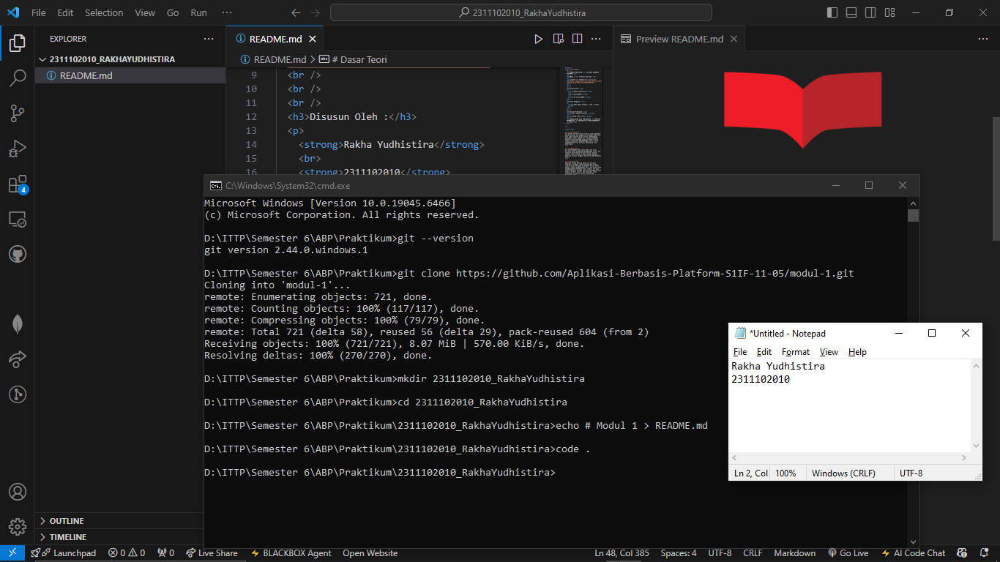

# Modul 1 
# Modul 1 

   
  <h1>LAPORAN PRAKTIKUM   APLIKASI BERBASIS PLATFORM </h1>
   
  <h3>MODUL 1   Instalasi dan GIT </h3>
   
  
   
   
   
  <h3>Disusun Oleh :</h3>
  

    <strong>Rakha Yudhistira</strong>
     
    <strong>2311102010</strong>
     
    <strong>S1 IF-11-REG05</strong>
  

   
  <h3>Dosen Pengampu :</h3>
  

    <strong>Dedi Agung Prabowo, S.Kom., M.Kom</strong>
  

   
   
  <h4>Asisten Praktikum :</h4>
  <strong>Apri Pandu Wicaksono </strong>
   
  <strong>Hamka Zaenul Ardi</strong>
   
  <h3>LABORATORIUM HIGH PERFORMANCE  FAKULTAS INFORMATIKA  UNIVERSITAS TELKOM PURWOKERTO  2026 </h3>

# Dasar Teori

Git adalah sistem version control yang digunakan untuk mencatat dan mengelola perubahan pada file atau kode program selama proses pengembangan perangkat lunak. Dengan Git, setiap perubahan dapat dilacak sehingga pengguna dapat melihat riwayat perubahan, membandingkan versi, serta mengembalikan file ke versi sebelumnya jika diperlukan.

Git dikembangkan pada tahun 2005 oleh Linus Torvalds untuk mendukung pengembangan Linux. Git termasuk Distributed Version Control System (DVCS), yaitu sistem di mana setiap pengguna memiliki salinan lengkap repository pada komputer lokal.

Beberapa konsep penting dalam Git meliputi repository sebagai tempat penyimpanan proyek, commit untuk menyimpan perubahan, branch untuk membuat cabang pengembangan baru, dan merge untuk menggabungkan perubahan antar cabang. Git juga dapat digunakan bersama platform penyimpanan kode seperti GitHub, GitLab, dan Bitbucket untuk memudahkan kolaborasi dalam pengembangan perangkat lunak.

# Screenshoot Program

