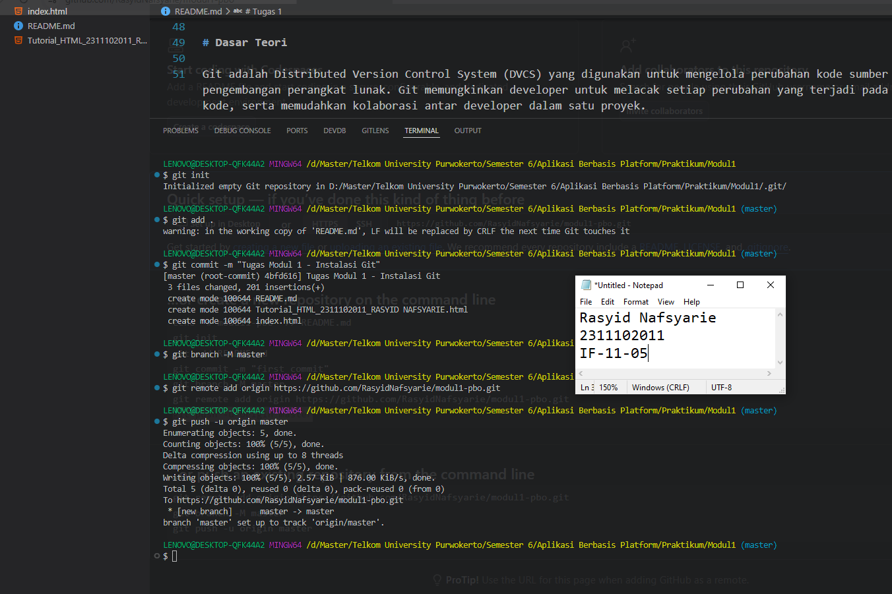

# Aplikasi Berbasis Platform (ABP)

## Pendahuluan
Selamat datang di repositori mata kuliah **Aplikasi Berbasis Platform** S1IF-11-05!

Mata kuliah ini dirancang untuk membekali mahasiswa dengan kemampuan membangun aplikasi yang efisien, skalabel, dan tangguh menggunakan bahasa pemrograman **Dart (Flutter)** untuk aplikasi mobile dan **PHP (Laravel)** untuk backend. Repositori ini akan menjadi panduan utama Anda dalam mengeksplorasi sintaksis, logika, hingga implementasi platform.

---

**Selamat, Berjuang, Suksess**

## Format Laporan Praktikum (README.md)

<div align="center">
  <br />
  <h1>LAPORAN PRAKTIKUM <br> APLIKASI BERBASIS PLATFORM </h1>
  <br />
  <h3>MODUL 1 <br> Instalasi dan GIT </h3>
  <br />
  
  <br />
  <br />
  <br />
  <h3>Disusun Oleh :</h3>
  <p>
    <strong>Rasyid Nafsyarie</strong>
    <br>
    <strong>2311102011</strong>
    <br>
    <strong>S1 IF-11-REG05</strong>
  </p>
  <br />
  <h3>Dosen Pengampu :</h3>
  <p>
    <strong>Dedi Agung Prabowo, S.Kom., M.Kom</strong>
  </p>
  <br />
  <br />
  <h4>Asisten Praktikum :</h4>
  <strong>Apri Pandu Wicaksono </strong>
  <br>
  <strong>Hamka Zaenul Ardi</strong>
  <br />
  <h3>LABORATORIUM HIGH PERFORMANCE <br>FAKULTAS INFORMATIKA <br>UNIVERSITAS TELKOM PURWOKERTO <br>2026 </h3>
</div>

<hr>

# Dasar Teori

Git adalah Distributed Version Control System (DVCS) yang digunakan untuk mengelola perubahan kode sumber selama proses pengembangan perangkat lunak. Git memungkinkan developer untuk melacak setiap perubahan yang terjadi pada file, mengelola versi kode, serta memudahkan kolaborasi antar developer dalam satu proyek.

Git pertama kali dikembangkan oleh Linus Torvalds pada tahun 2005 untuk mendukung pengembangan kernel Linux.

Dengan Git, setiap perubahan kode dapat dicatat dalam bentuk commit sehingga developer dapat mengetahui siapa yang melakukan perubahan, kapan perubahan dilakukan, dan bagian kode apa yang berubah.

# Tugas 1
```
//2311102011
//Rasyid Nafsyarie

```
Output:

