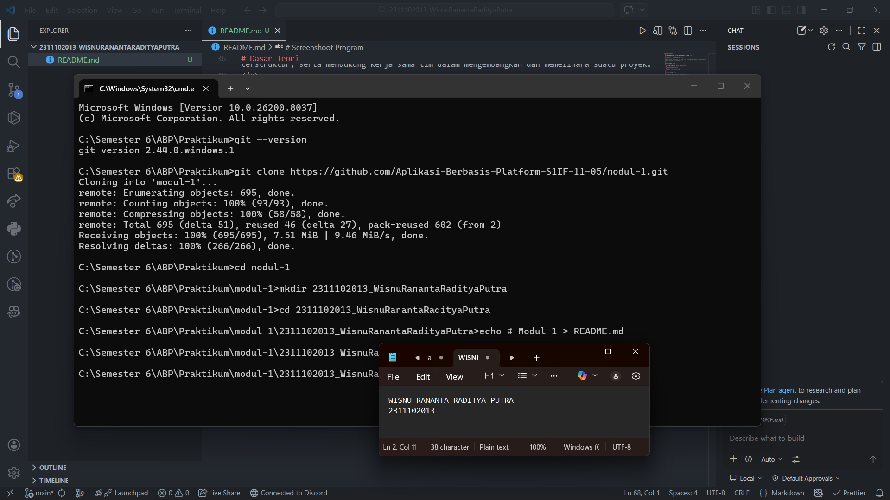

   
  <h1>LAPORAN PRAKTIKUM   APLIKASI BERBASIS PLATFORM </h1>
   
  <h3>MODUL 1   Instalasi dan GIT </h3>
   
  
   
   
   
  <h3>Disusun Oleh :</h3>
  

    <strong>Wisnu Rananta Raditya Putra</strong>
     
    <strong>2311102013</strong>
     
    <strong>S1 IF-11-REG05</strong>
  

   
  <h3>Dosen Pengampu :</h3>
  

    <strong>Dedi Agung Prabowo, S.Kom., M.Kom</strong>
  

   
   
  <h4>Asisten Praktikum :</h4>
  <strong>Apri Pandu Wicaksono </strong>
   
  <strong>Hamka Zaenul Ardi</strong>
   
  <h3>LABORATORIUM HIGH PERFORMANCE  FAKULTAS INFORMATIKA  UNIVERSITAS TELKOM PURWOKERTO  2026 </h3>

# Dasar Teori

Git merupakan sistem kontrol versi (Version Control System/VCS) yang digunakan untuk melacak, menyimpan, dan mengelola perubahan pada file dalam suatu proyek, terutama pada pengembangan perangkat lunak. Git dikembangkan oleh Linus Torvalds pada tahun 2005 untuk mendukung pengembangan Linux. Dengan Git, setiap perubahan pada kode dapat dicatat dalam bentuk commit sehingga riwayat perubahan dapat dilihat, dibandingkan, atau dikembalikan ke versi sebelumnya.

Selain itu, GitHub merupakan platform berbasis web yang digunakan untuk menyimpan dan mengelola repository Git secara online. GitHub memungkinkan pengembang untuk bekerja secara kolaboratif dalam suatu proyek dengan fitur seperti penyimpanan repository, manajemen branch, pull request, serta pelacakan perubahan kode. Melalui GitHub, pengguna dapat berbagi kode, berkolaborasi dengan tim, serta mengelola proyek secara lebih terorganisir.

Dengan memanfaatkan Git sebagai sistem kontrol versi dan GitHub sebagai layanan hosting repository, proses pengembangan perangkat lunak dapat dilakukan secara lebih efisien, terstruktur, serta mendukung kerja sama tim dalam mengembangkan dan memelihara suatu proyek.

# Tugas 1

1. Download Git dan Install
2. Buka CMD, ketik `git --version`
3. clone repository MODUL 1 `git clone https://github.com/Aplikasi-Berbasis-Platform-S1IF-11-05/modul-1.git`
4. Buat Folder NIM_NAMA `mkdir 2311102013_WisnuRanantaRadityaPutra`
5. Masuk ke folder yang sudah dibuat `cd 2311102013_WisnuRanantaRadityaPutra`
6. Buat File README.md `echo # Modul 1 > README.md`
7. ketik `code .` untuk mengedit file README.md di VS Code
8. Setelah selesai edit, kembali ke folder repo sebelumnya `cd ..`
9. Tambahkan folder ke repository `git add .`
10. Tambahkan commit `git commit -m "Modul 1"`
11. Sebelum push, lakukan pull terlebih dahulu untuk sinkronasi `git pull --rebase origin main`
12. Push perupahan ke repository `git push origin main`

# Screenshoot Program

