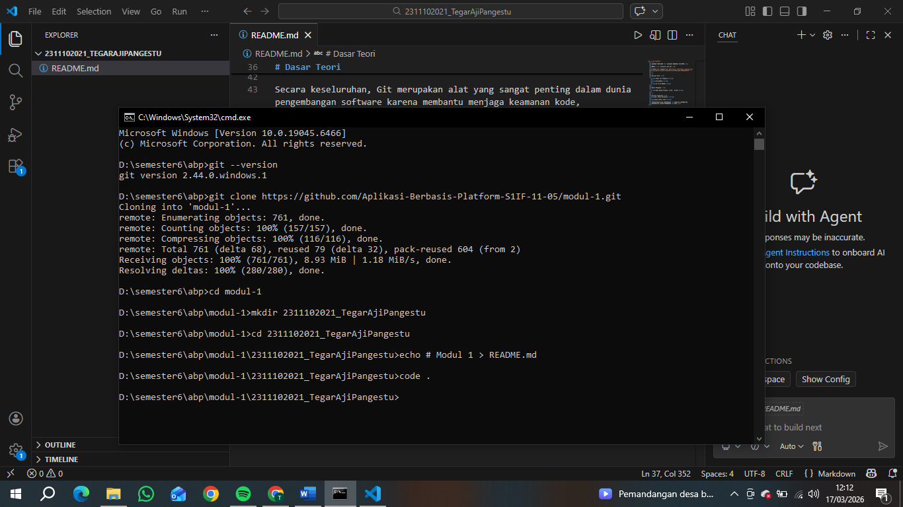

   
  <h1>LAPORAN PRAKTIKUM   APLIKASI BERBASIS PLATFORM </h1>
   
  <h3>MODUL 1   Instalasi dan GIT </h3>
   
  
   
   
   
  <h3>Disusun Oleh :</h3>
  

    <strong>Tegar Aji Pangestu</strong>
     
    <strong>2311102021</strong>
     
    <strong>S1 IF-11-REG05</strong>
  

   
  <h3>Dosen Pengampu :</h3>
  

    <strong>Dedi Agung Prabowo, S.Kom., M.Kom</strong>
  

   
   
  <h4>Asisten Praktikum :</h4>
  <strong>Apri Pandu Wicaksono </strong>
   
  <strong>Hamka Zaenul Ardi</strong>
   
  <h3>LABORATORIUM HIGH PERFORMANCE  FAKULTAS INFORMATIKA  UNIVERSITAS TELKOM PURWOKERTO  2026 </h3>

# Dasar Teori
Git adalah sebuah sistem kontrol versi (version control system) yang digunakan untuk melacak perubahan dalam file, terutama dalam pengembangan perangkat lunak. Dengan Git, setiap perubahan yang dilakukan pada kode dapat disimpan sebagai riwayat (commit), sehingga memudahkan pengembang untuk kembali ke versi sebelumnya jika terjadi kesalahan. Selain itu, Git juga memungkinkan banyak orang bekerja dalam satu proyek yang sama secara bersamaan tanpa saling mengganggu pekerjaan satu sama lain.

Dalam penggunaannya, Git memiliki beberapa konsep dasar seperti repository (repo), yaitu tempat penyimpanan proyek beserta seluruh riwayat perubahannya. Setiap perubahan yang disimpan disebut commit, yang berfungsi sebagai snapshot dari kondisi proyek pada waktu tertentu. Git juga menyediakan fitur branch, yaitu cabang pengembangan yang memungkinkan pengembang membuat fitur baru tanpa mengganggu kode utama. Setelah selesai, perubahan dari branch tersebut dapat digabungkan kembali ke branch utama melalui proses yang disebut merge.

Alur kerja Git dimulai dari working directory, yaitu tempat kita mengedit file, kemudian perubahan tersebut dimasukkan ke staging area menggunakan perintah seperti git add, sebelum akhirnya disimpan secara permanen ke dalam repository menggunakan git commit. Git juga dapat terhubung dengan layanan penyimpanan online seperti GitHub, sehingga proyek dapat disimpan secara daring dan dibagikan kepada orang lain. Melalui perintah seperti git push dan git pull, pengguna dapat mengirim dan mengambil perubahan dari repository jarak jauh.

Secara keseluruhan, Git merupakan alat yang sangat penting dalam dunia pengembangan software karena membantu menjaga keamanan kode, memudahkan kolaborasi tim, serta memungkinkan pengelolaan berbagai versi proyek dengan lebih terstruktur dan efisien.

//2311102021
//Tegar Aji Pangestu

Output:

