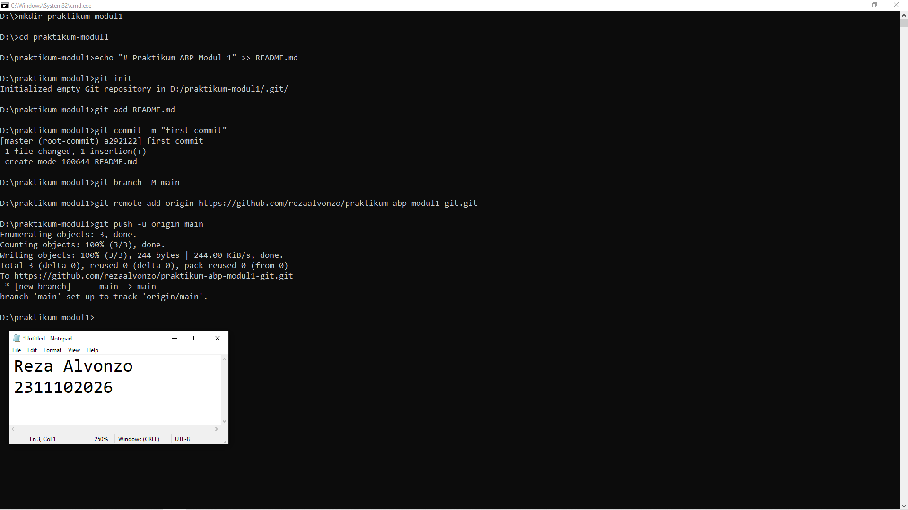

# Aplikasi Berbasis Platform (ABP)

## Pendahuluan
Selamat datang di repositori mata kuliah **Aplikasi Berbasis Platform** S1IF-11-05!

Mata kuliah ini dirancang untuk membekali mahasiswa dengan kemampuan membangun aplikasi yang efisien, skalabel, dan tangguh menggunakan bahasa pemrograman **Dart (Flutter)** untuk aplikasi mobile dan **PHP (Laravel)** untuk backend. Repositori ini akan menjadi panduan utama Anda dalam mengeksplorasi sintaksis, logika, hingga implementasi platform.

---

**Selamat, Berjuang, Suksess**

## Format Laporan Praktikum (README.md)

<div align="center">
  <br />
  <h1>LAPORAN PRAKTIKUM <br> APLIKASI BERBASIS PLATFORM </h1>
  <br />
  <h3>MODUL 1 <br> Instalasi dan GIT </h3>
  <br />
  
  <br />
  <br />
  <br />
  <h3>Disusun Oleh :</h3>
  <p>
    <strong>Reza Alvonzo</strong>
    <br>
    <strong>2311102026</strong>
    <br>
    <strong>S1 IF-11-REG05</strong>
  </p>
  <br />
  <h3>Dosen Pengampu :</h3>
  <p>
    <strong>Dedi Agung Prabowo, S.Kom., M.Kom</strong>
  </p>
  <br />
  <br />
  <h4>Asisten Praktikum :</h4>
  <strong>Apri Pandu Wicaksono </strong>
  <br>
  <strong>Hamka Zaenul Ardi</strong>
  <br />
  <h3>LABORATORIUM HIGH PERFORMANCE <br>FAKULTAS INFORMATIKA <br>UNIVERSITAS TELKOM PURWOKERTO <br>2026 </h3>
</div>

<hr>

# Dasar Teori

## 1. Definisi dan Konsep Version Control System (VCS)
Version Control System (VCS) atau Sistem Kontrol Versi adalah sebuah infrastruktur perangkat lunak yang berfungsi untuk mengelola perubahan pada sekumpulan berkas data (kode sumber) secara kumulatif. Menurut Somervile (2016), sistem ini memungkinkan pengembang untuk melacak histori modifikasi, melakukan perbandingan antar-versi (diffing), serta memulihkan kondisi data ke titik waktu tertentu (rollback) apabila terjadi kegagalan sistem.

Secara umum, VCS diklasifikasikan menjadi dua arsitektur utama: Centralized VCS (seperti Subversion) dan Distributed VCS. Git termasuk ke dalam kategori Distributed Version Control System (DVCS), di mana setiap pengguna memiliki salinan lokal penuh dari seluruh riwayat repositori, bukan sekadar snapshot dari versi terbaru.

## 2. Arsitektur dan Mekanisme Kerja Git
Berbeda dengan sistem kontrol versi tradisional yang menyimpan perubahan berbasis deltas (selisih karakter), Git memperlakukan data sebagai sekumpulan aliran snapshots dari sebuah sistem berkas miniatur. Setiap kali pengguna melakukan operasi simpan (commit), Git mengambil gambar dari kondisi berkas pada saat itu dan menyimpan referensi ke snapshot tersebut.

Git beroperasi melalui tiga area utama dalam siklus hidup pengembangan perangkat lunak:

Working Directory: Area lokal tempat pengguna melakukan modifikasi berkas secara langsung.

Staging Area (Index): Sebuah berkas atau area teknis yang menyimpan informasi mengenai apa yang akan masuk ke dalam commit berikutnya.

Git Directory (Repository): Tempat penyimpanan metadata dan basis data objek untuk proyek tersebut.

## 3. Integritas Data dan Hash SHA-1
Aspek krusial dalam Git adalah integritas data. Setiap entitas dalam Git (berkas, direktori, commit) diidentifikasi menggunakan mekanisme checksum sebelum disimpan. Mekanisme ini menggunakan algoritma SHA-1 (Secure Hash Algorithm 1), yang menghasilkan string heksadesimal 40 karakter. Hal ini menjamin bahwa setiap perubahan pada isi berkas atau struktur direktori akan terdeteksi secara instan oleh sistem karena akan menghasilkan nilai hash yang berbeda.

## 4. Percabangan (Branching) dan Penggabungan (Merging)
Model percabangan pada Git dianggap sebagai fitur unggulan yang membedakannya dari VCS lain. Branch dalam Git pada dasarnya adalah penunjuk (pointer) yang bersifat ringan dan dapat berpindah-pindah ke arah commit tertentu.

Branching: Memungkinkan pengembang untuk mengisolasi fitur baru atau perbaikan bug dari lini utama (main/master) guna menjaga stabilitas kode produksi.

Merging: Proses integrasi kembali riwayat pengembangan dari satu cabang ke cabang lainnya. Git menggunakan algoritma three-way merge untuk menggabungkan perubahan yang terjadi pada dua cabang yang memiliki basis commit yang sama.

## 5. Kolaborasi melalui Repositori Jarak Jauh (Remote Repository)
Dalam konteks pengembangan kolaboratif, Git memfasilitasi sinkronisasi antar-repositori lokal melalui protokol jaringan (seperti HTTPS atau SSH). Platform seperti GitHub atau GitLab bertindak sebagai remote server yang menjadi pusat sinkronisasi, memungkinkan tim pengembang untuk melakukan operasi push (mengirim data ke server) dan pull (mengambil dan mengintegrasikan data dari server) secara asinkron.

# Tugas 1
```

```
Output:

