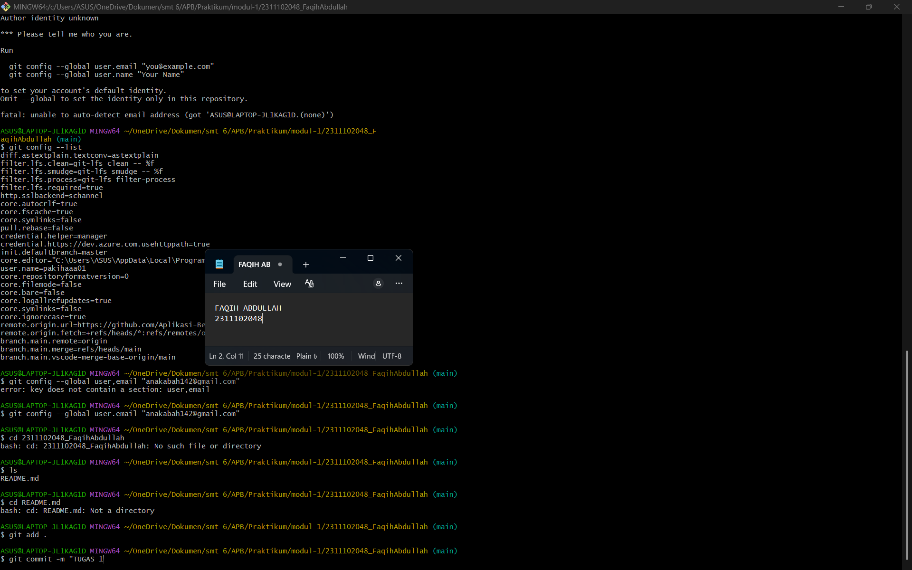

# LAPORAN PRAKTIKUM  
## APLIKASI BERBASIS PLATFORM  

### MODUL 1  
### Instalasi dan Penggunaan Git

 

  

### Disusun Oleh

**Faqih Abdullah**  
**2311102048**  
**S1 IF-11-REG05**

 

### Dosen Pengampu
Dedi Agung Prabowo, S.Kom., M.Kom

 

### Asisten Praktikum
Apri Pandu Wicaksono  
Hamka Zaenul Ardi

  

**LABORATORIUM HIGH PERFORMANCE**  
**FAKULTAS INFORMATIKA**  
**UNIVERSITAS TELKOM PURWOKERTO**  

2026

---

# Dasar Teori

Git merupakan sistem kontrol versi (Version Control System) yang digunakan untuk mengelola dan melacak perubahan pada file dalam suatu proyek. Sistem ini banyak digunakan dalam pengembangan perangkat lunak karena mampu menyimpan riwayat perubahan kode sehingga setiap versi yang pernah dibuat dapat dilihat kembali atau dikembalikan apabila diperlukan.

Git pertama kali dikembangkan oleh Linus Torvalds pada tahun 2005 untuk membantu pengembangan kernel Linux. Dengan menggunakan Git, pengembang dapat bekerja secara lebih terorganisir karena setiap perubahan yang dilakukan dicatat dalam bentuk commit.

Selain Git, terdapat pula platform berbasis web bernama GitHub yang berfungsi sebagai tempat penyimpanan repository Git secara online. GitHub memungkinkan pengguna untuk menyimpan proyek, berbagi kode, serta melakukan kolaborasi dengan tim melalui fitur seperti repository, branch, pull request, dan issue tracking.

Dengan adanya Git dan GitHub, proses pengembangan perangkat lunak menjadi lebih efisien karena perubahan kode dapat dilacak dengan jelas serta memudahkan kerja sama antar pengembang dalam satu proyek.

---

# Tugas 1 – Instalasi dan Konfigurasi Git

Berikut langkah-langkah yang dilakukan pada praktikum modul 1.

1. Menginstall Git pada komputer.
2. Memastikan instalasi Git berhasil dengan menjalankan perintah: git --version
3. Mengunduh repository modul praktikum dari GitHub: git clone https://github.com/Aplikasi-Berbasis-Platform-S1IF-11-05/modul-1.git
4. Membuat folder tugas sesuai format **NIM_Nama**: mkdir 2311102048_FaqihAbdullah
5. Masuk ke dalam folder yang telah dibuat: cd 2311102048_Faqih
6. Membuat file README.md sebagai laporan praktikum: echo "# Modul 1" > README.md
7. Mengedit file menggunakan Visual Studio Code
8. Menambahkan perubahan ke staging area: git add .
9. Melakukan commit untuk menyimpan perubahan: git commit -m "Laporan Praktikum Modul 1"
10. Melakukan sinkronisasi dengan repository utama sebelum push: git pull --rebase origin main
11. Mengunggah perubahan ke repository GitHub: git push origin main

---

# Hasil Praktikum

Berikut merupakan hasil dari proses praktikum yang telah dilakukan menggunakan Git melalui Command Line Interface.

Pada tahap ini seluruh proses mulai dari cloning repository, pembuatan folder tugas, pembuatan file laporan README.md, hingga proses commit dan push ke GitHub telah berhasil dilakukan.

---

# Screenshot Program

