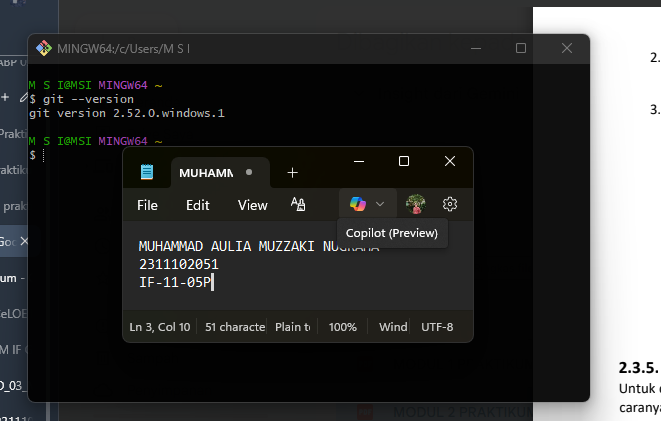
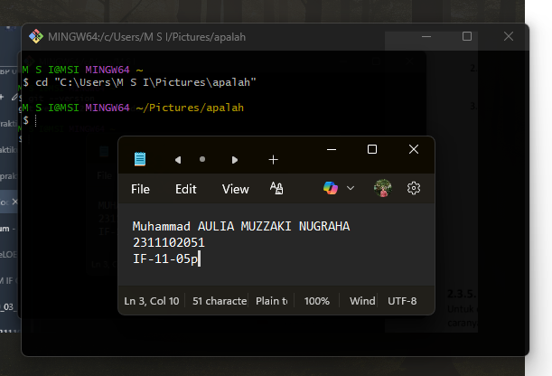
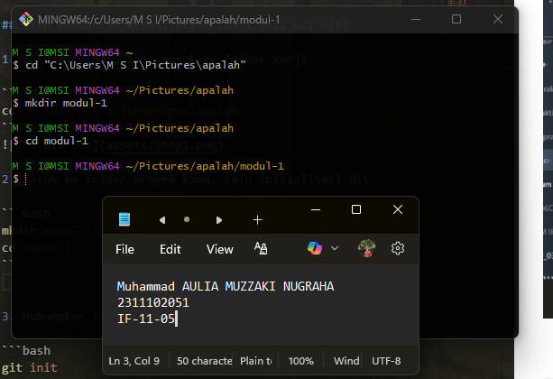
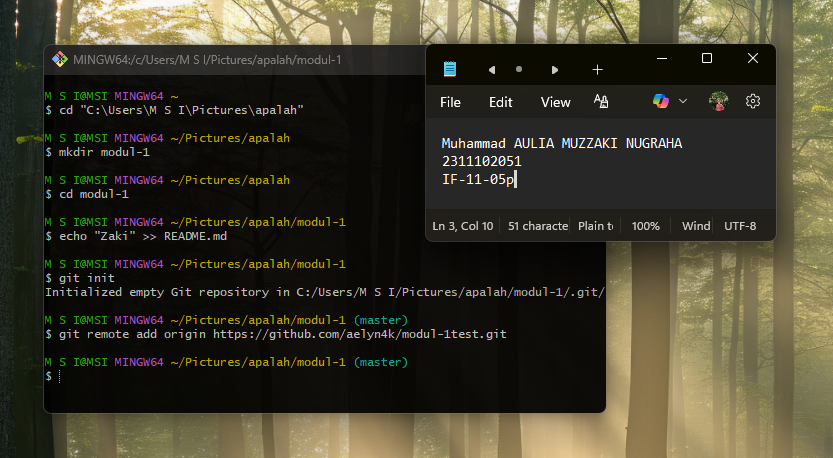
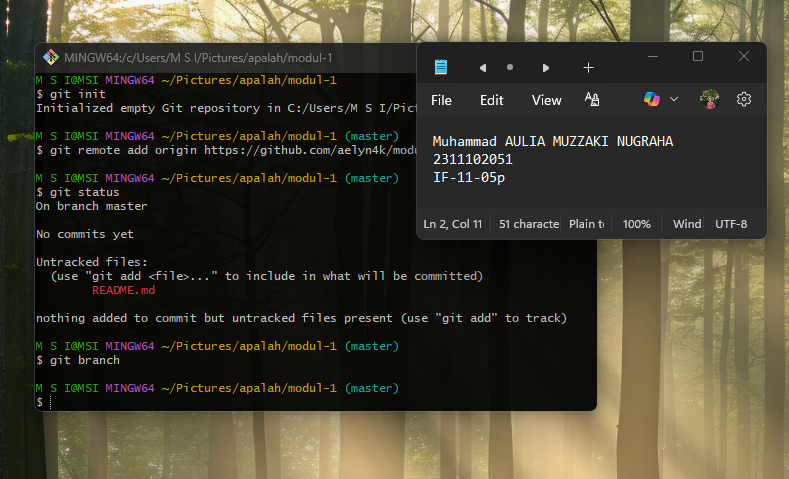
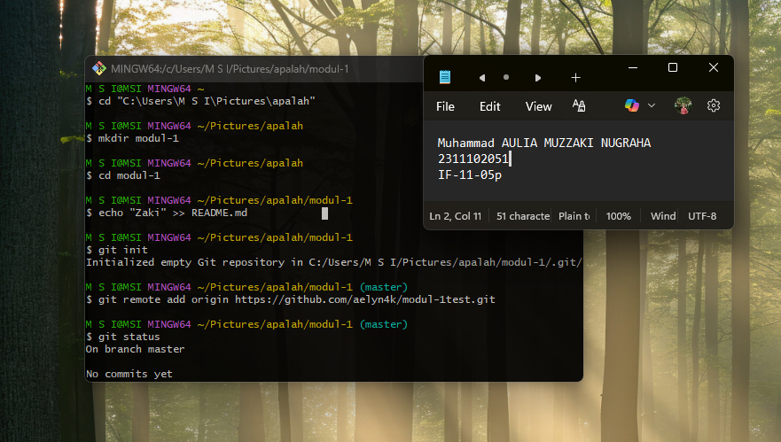
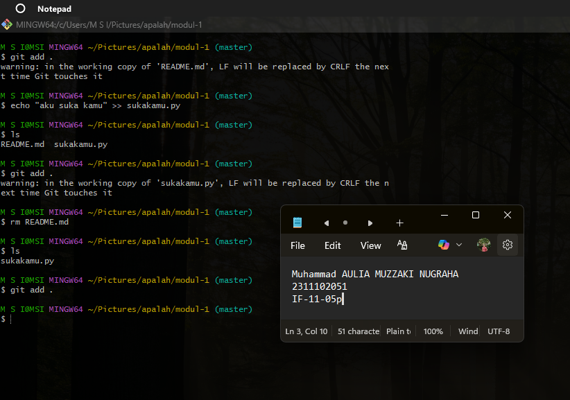
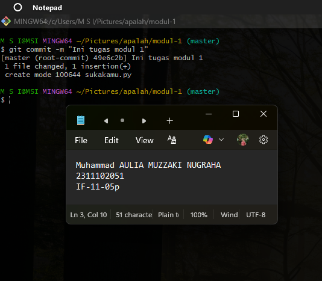
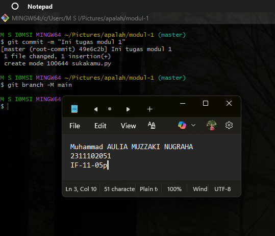

<div align="center">
  <br />
  <h1>LAPORAN PRAKTIKUM <br> APLIKASI BERBASIS PLATFORM </h1>
  <br />
  <h3>MODUL 1 <br> Instalasi dan GIT </h3>
  <br />
  
  <br />
  <br />
  <br />
  <h3>Disusun Oleh :</h3>
  <p>
    <strong>MUHAMMAD AULIA MUZZAKI NUGRAHA</strong>
    <br>
    <strong>2311102051</strong>
    <br>
    <strong>S1 IF-11-REG05</strong>
  </p>
  <br />
  <h3>Dosen Pengampu :</h3>
  <p>
    <strong>Dedi Agung Prabowo, S.Kom., M.Kom</strong>
  </p>
  <br />
  <br />
  <h4>Asisten Praktikum :</h4>
  <strong>Apri Pandu Wicaksono </strong>
  <br>
  <strong>Hamka Zaenul Ardi</strong>
  <br />
  <h3>LABORATORIUM HIGH PERFORMANCE <br>FAKULTAS INFORMATIKA <br>UNIVERSITAS TELKOM PURWOKERTO <br>2026 </h3>
</div>

<hr>

# Dasar Teori

Git adalah salah satu sistem pengontrol versi (Version Control System) pada proyek perangkat lunak yang diciptakan oleh Linus Torvalds.
Pengontrol versi bertugas mencatat setiap perubahan pada file proyek yang dikerjakan oleh banyak orang maupun sendiri.
Git dikenal juga dengan distributed revision control (VCS terdistribusi), artinya penyimpanan database Git tidak hanya berada dalam satu tempat saja.

Secara umum, Git digunakan untuk memantau riwayat perubahan kode, dokumen, maupun aset proyek sehingga setiap perubahan dapat dilacak dengan jelas. Dengan Git, pengembang dapat mengetahui siapa yang mengubah file, kapan perubahan dilakukan, dan apa isi perubahan tersebut. Hal ini sangat penting dalam pengembangan perangkat lunak karena proyek biasanya dikerjakan secara bertahap dan sering kali melibatkan lebih dari satu orang.

Git bekerja dengan konsep repository, yaitu tempat penyimpanan seluruh file proyek beserta riwayat versinya. Repository dapat berbentuk repository lokal yang berada di komputer pengguna, dan repository remote yang berada di server seperti GitHub. Repository lokal dipakai untuk mengelola file secara langsung, sedangkan repository remote digunakan untuk backup, kolaborasi tim, dan sinkronisasi hasil pekerjaan.

Dalam penggunaan Git terdapat beberapa konsep penting, yaitu working directory, staging area, dan commit. Working directory adalah area kerja tempat file diedit secara langsung. Setelah file diubah, perubahan tersebut belum langsung masuk ke riwayat Git, melainkan perlu ditambahkan terlebih dahulu ke staging area menggunakan perintah `git add`. Setelah itu, perubahan disimpan secara permanen ke riwayat versi melalui `git commit`. Commit dapat dipahami sebagai snapshot kondisi proyek pada waktu tertentu.

Git juga menyediakan branch, yaitu cabang pengembangan yang memungkinkan pengguna mengerjakan fitur atau perubahan tertentu tanpa mengganggu branch utama. Pada banyak proyek, branch utama biasanya bernama `main`. Dengan branch, proses pengembangan menjadi lebih aman dan terstruktur karena perubahan dapat diuji terlebih dahulu sebelum digabungkan ke branch utama.

Selain Git, terdapat GitHub yang sering digunakan bersama Git. Git adalah tools untuk mengelola versi, sedangkan GitHub adalah platform hosting repository berbasis cloud. GitHub mempermudah penyimpanan repository remote, kolaborasi tim, pembuatan pull request, review kode, dan dokumentasi proyek. Jadi, Git dan GitHub saling berkaitan, tetapi keduanya memiliki fungsi yang berbeda.

Salah satu proses penting dalam Git adalah `git push`, yaitu perintah untuk mengirim commit dari repository lokal ke repository remote. Perintah ini digunakan agar hasil pekerjaan yang telah di-commit di komputer lokal dapat tersimpan di GitHub. Dengan demikian, data proyek menjadi lebih aman dan dapat diakses dari perangkat lain atau oleh anggota tim lainnya. Sebaliknya, untuk mengambil perubahan dari repository remote ke lokal biasanya digunakan `git pull` atau `git fetch`.

Pada praktikum ini, penggunaan Git melalui Command Line Interface (CLI) juga memberikan pemahaman yang lebih mendasar terhadap alur kerja Git. Dengan CLI, pengguna dapat memahami urutan proses secara jelas, mulai dari inisialisasi repository, pengecekan status file, penambahan file ke staging area, commit perubahan, hingga push ke GitHub. Pemahaman ini penting sebagai dasar sebelum menggunakan tools berbasis antarmuka grafis.

# Task 1: Pemanasan Terminal

Setup repository-nya wajib via CLI ya. Simpen dulu mouse lu, biasain ngetik command biar kelihatan kayak hacker beneran. [aku heker kata mamah]

## Install Git



## Step Pembuatan Repository Pribadi (Via CLI Git)

1. Buka terminal, lalu masuk ke folder kerja.

```bash
cd "C:\Users\M S I\Pictures\apalah"
```



2. Masuk ke folder proyek kamu.

```bash
mkdir modul-1
cd modul-1
```



3. Lalu inisialisasi Git, hubungkan folder lokal ke repository GitHub pribadi.

```bash
git init
git remote add origin https://github.com/aelyn4k/modul-1test.git
```



4. Cek status dan branch aktif.

```bash
git status
git branch
```



5. Buat atau edit file laporan pada folder masing-masing.

```bash
echo "Zaki" >> README.md
```



6. Tambahkan perubahan ke staging area.

```bash
git add .
```



7. Commit perubahan.

```bash
git commit -m "Ini tugas modul 1"
```



8. Pastikan branch utama bernama `main`.

```bash
git branch -M main
```



9. Push hasil commit pertama ke GitHub pribadi.

```bash
git push -u origin main
```

.png>)
.png>)

## Penjelasan Perintah Git yang Digunakan

1. `git init`

Perintah ini digunakan untuk menginisialisasi sebuah folder biasa menjadi repository Git. Setelah perintah ini dijalankan, Git akan membuat folder tersembunyi `.git` yang berisi seluruh metadata dan riwayat versi proyek.

2. `git remote add origin <url>`

Perintah ini berfungsi menghubungkan repository lokal dengan repository remote. Kata `origin` merupakan nama alias default untuk alamat repository remote utama. Dengan adanya remote ini, repository lokal dapat melakukan push dan pull ke GitHub.

3. `git status`

Perintah ini menampilkan kondisi terbaru repository, seperti file yang berubah, file yang belum dimasukkan ke staging area, dan file yang siap di-commit. Perintah ini sangat penting untuk mengecek apa saja yang sedang terjadi pada proyek.

4. `git branch`

Perintah ini digunakan untuk melihat branch yang tersedia dan mengetahui branch mana yang sedang aktif. Dalam praktikum ini, branch utama yang digunakan adalah `main`.

5. `git add .`

Perintah ini menambahkan seluruh file yang berubah pada folder aktif ke staging area. Tanda titik (`.`) berarti semua perubahan di direktori saat ini akan dipersiapkan untuk proses commit.

6. `git commit -m "Ini tugas modul 1"`

Perintah commit menyimpan snapshot perubahan yang sudah ada di staging area ke dalam riwayat Git. Opsi `-m` digunakan untuk memberikan pesan commit agar isi perubahan mudah dikenali pada riwayat proyek.

7. `git branch -M main`

Perintah ini digunakan untuk mengganti nama branch aktif menjadi `main`. Opsi `-M` memaksa proses penggantian nama meskipun branch tujuan sudah ada atau perlu ditimpa.

8. `git push -u origin main`

Perintah ini mengirim seluruh commit pada branch `main` di repository lokal ke branch `main` pada remote `origin`. Opsi `-u` atau `--set-upstream` berfungsi untuk menghubungkan branch lokal dengan branch remote tujuan, sehingga pada push berikutnya cukup menggunakan `git push` tanpa menuliskan nama remote dan branch secara lengkap.

9. `echo "Zaki" >> README.md`

Perintah ini digunakan untuk menambahkan teks ke file `README.md` langsung melalui terminal. Pada praktikum, perintah ini menunjukkan bahwa pembuatan atau pengeditan file juga dapat dilakukan dari CLI tanpa harus membuka editor grafis.
