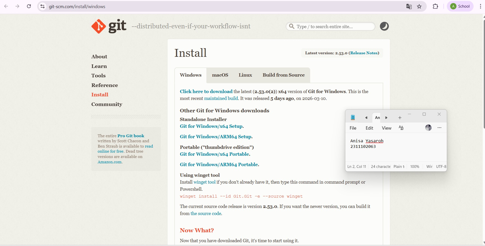
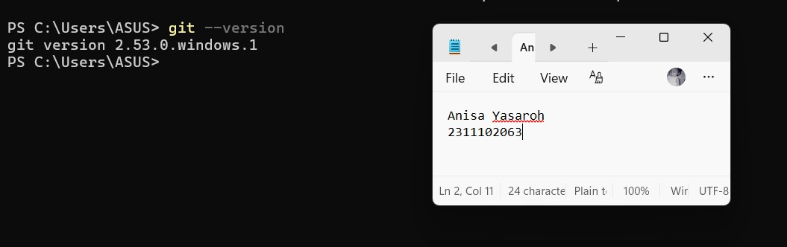
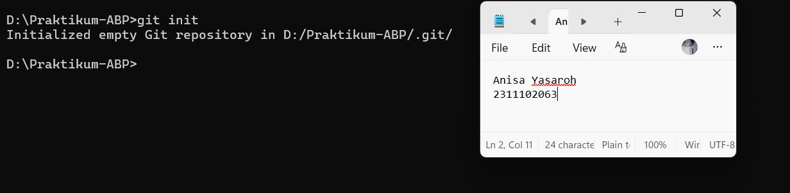
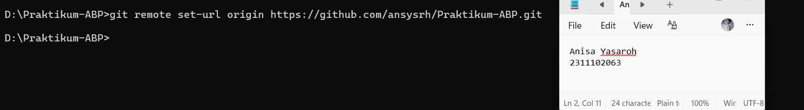
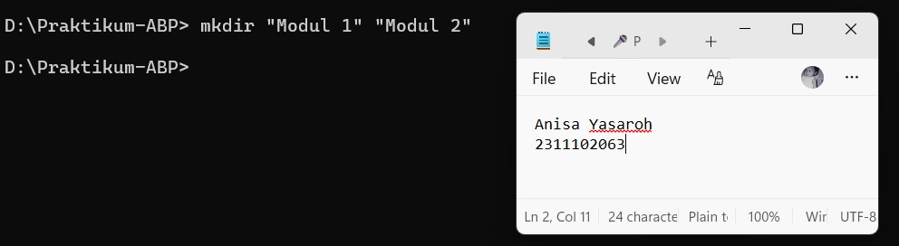
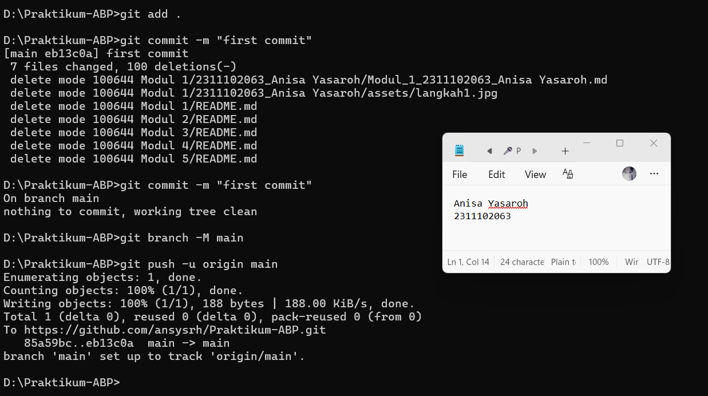

<div align="center">
  <br />
  <h1>LAPORAN PRAKTIKUM <br> APLIKASI BERBASIS PLATFORM </h1>
  <br />
  <h3>MODUL 1 <br> Instalasi dan GIT </h3>
  <br />
  
  <br />
  <br />
  <br />
  <h3>Disusun Oleh :</h3>
  <p>
    <strong>Anisa Yasaroh</strong>
    <br>
    <strong>2311102063</strong>
    <br>
    <strong>S1 IF-11-REG05</strong>
  </p>
  <br />
  <h3>Dosen Pengampu :</h3>
  <p>
    <strong>Dedi Agung Prabowo, S.Kom., M.Kom</strong>
  </p>
  <br />
  <br />
  <h4>Asisten Praktikum :</h4>
  <strong>Apri Pandu Wicaksono </strong>
  <br>
  <strong>Hamka Zaenul Ardi</strong>
  <br />
  <h3>LABORATORIUM HIGH PERFORMANCE <br>FAKULTAS INFORMATIKA <br>UNIVERSITAS TELKOM PURWOKERTO <br>2026 </h3>
</div>

<hr>

# Dasar Teori

Git adalah sistem pengontrol versi (Version Control System) yang dibuat oleh Linus Torvalds pada tahun 2005. Git digunakan untuk mencatat setiap perubahan yang terjadi pada file dalam sebuah proyek perangkat lunak. Sistem ini bersifat terdistribusi, sehingga setiap orang yang bekerja dalam proyek memiliki salinan lengkap dari data proyek. Dengan Git, pengguna dapat melihat riwayat perubahan file, mengetahui siapa yang melakukan perubahan, serta kembali ke versi sebelumnya apabila terjadi kesalahan.

Selain itu, Git juga memudahkan kolaborasi tim dalam mengembangkan sebuah proyek. Banyak orang dapat bekerja pada proyek yang sama secara bersamaan tanpa saling mengganggu pekerjaan satu sama lain. Git juga menyediakan fitur seperti branching dan merging yang memungkinkan pengembang membuat cabang baru untuk mengembangkan fitur atau memperbaiki kesalahan sebelum digabungkan kembali ke cabang utama.

Dalam penggunaannya, Git sering dipadukan dengan platform GitHub. GitHub merupakan layanan berbasis web yang digunakan untuk menyimpan dan mengelola repository Git secara online. Melalui GitHub, pengguna dapat menyimpan proyek di cloud, membagikan kode kepada orang lain, serta berkolaborasi dengan tim secara lebih mudah. GitHub juga menyediakan berbagai fitur tambahan seperti pelacakan perubahan, manajemen proyek, serta sistem diskusi untuk mendukung proses pengembangan perangkat lunak.

Penggunaan Git dapat dilakukan melalui Command Line Interface (CLI) atau antarmuka baris perintah. CLI memungkinkan pengguna untuk menjalankan berbagai perintah Git secara langsung melalui terminal atau command prompt dengan mengetikkan perintah tertentu. Dengan CLI, pengguna dapat melakukan berbagai operasi seperti membuat repository, menambahkan file, melakukan commit, serta mengirim perubahan ke repository di GitHub. Penggunaan CLI membantu pengguna memahami proses kerja Git secara lebih mendalam karena semua perintah dilakukan secara manual melalui terminal.

# Task 1 : Pemanasan Terminal
```
//2311102063
//Anisa Yasaroh
```

# Menginstall Git
Instalasi Git dilakukan dengan mengunduh file installer melalui situs resmi Git. Setelah proses pengunduhan selesai, file installer dijalankan dan tahapan instalasi diikuti sesuai dengan petunjuk yang tersedia hingga proses instalasi berhasil diselesaikan.



# Mengecek Instalasi Git pada Terminal
Setelah proses instalasi selesai, langkah berikutnya adalah memastikan Git sudah terpasang dengan benar dengan menjalankan perintah berikut pada Command Prompt. Perintah : 
```
git --version
``` 
Apabila instalasi berhasil, maka terminal akan menampilkan informasi mengenai versi Git yang telah terpasang. 


# Setup Repository via CLI
# 1. Inisialisasi Repository Lokal
Langkah pertama adalah membuka Command Prompt (CMD) kemudian masuk ke direktori proyek yang akan digunakan. Setelah berada di folder tersebut, jalankan perintah berikut untuk membuat repository Git secara lokal.
```
git init
```


# 2. Menghubungkan dengan Repository GitHub
Setelah repository lokal dibuat, langkah selanjutnya adalah menghubungkannya dengan repository yang telah dibuat di GitHub menggunakan perintah berikut.
```
git remote add origin https://github.com/ansysrh/Praktikum-ABP.git
```


# 3. Membuat Folder Modul
Selanjutnya buat beberapa folder untuk setiap modul praktikum secara langsung melalui CMD dengan perintah berikut.
```
mkdir "Modul 1" "Modul 2" "Modul 3" "Modul 4" "Modul 5"
```


# 4. Mengunggah File ke GitHub
Tahap terakhir adalah menambahkan semua file ke staging area, melakukan commit, kemudian mengirimkannya ke repository GitHub.
```
git add .
git commit -m "first commit"
git branch -M main
git push -u origin main
```



