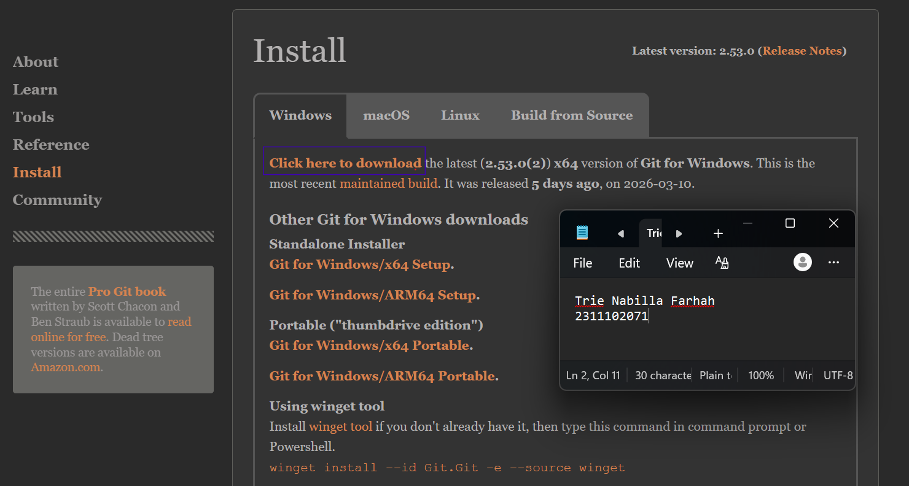
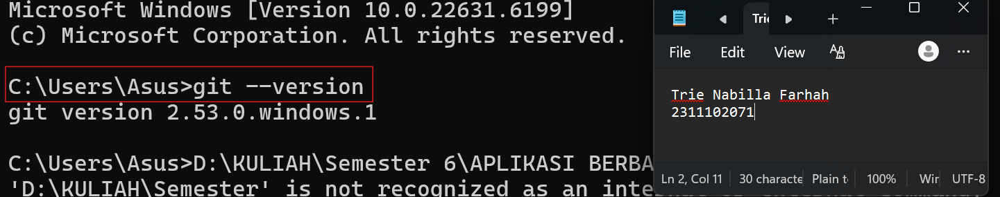
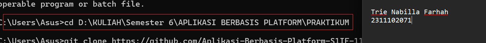
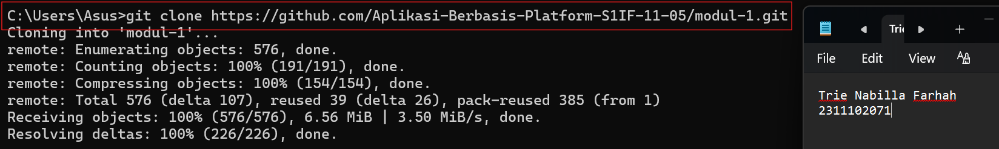
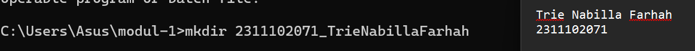
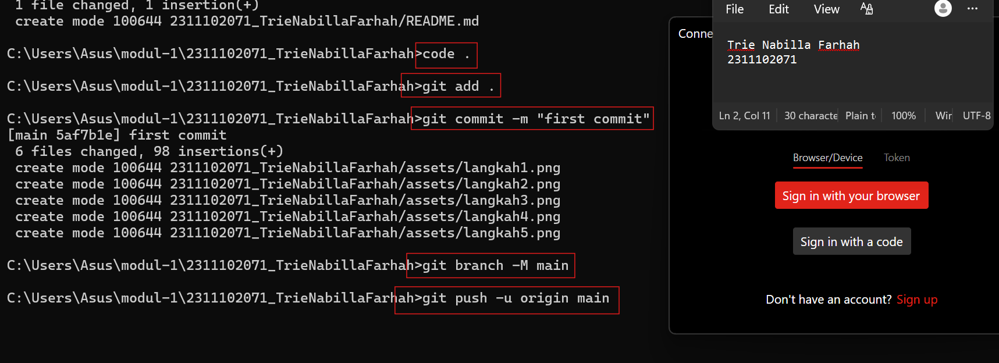

# Modul 1 

   
  <h1>LAPORAN PRAKTIKUM   APLIKASI BERBASIS PLATFORM </h1>
   
  <h3>MODUL 1   Instalasi dan GIT </h3>
   
  
   
   
   
  <h3>Disusun Oleh :</h3>
  

    <strong>Trie Nabilla Farhah</strong>
     
    <strong>2311102071</strong>
     
    <strong>S1 IF-11-REG05</strong>
  

   
  <h3>Dosen Pengampu :</h3>
  

    <strong>Dedi Agung Prabowo, S.Kom., M.Kom</strong>
  

   
   
  <h4>Asisten Praktikum :</h4>
  <strong>Apri Pandu Wicaksono </strong>
   
  <strong>Hamka Zaenul Ardi</strong>
   
  <h3>LABORATORIUM HIGH PERFORMANCE  FAKULTAS INFORMATIKA  UNIVERSITAS TELKOM PURWOKERTO  2026 </h3>

# Dasar Teori

Git merupakan salah satu Version Control System (VCS) yang dibuat oleh Linus Torvalds pada tahun 2005. Sistem ini digunakan untuk melacak dan menyimpan setiap perubahan yang terjadi pada file dalam suatu proyek perangkat lunak. Berbeda dengan sistem pengontrol versi yang terpusat, Git menggunakan konsep distributed version control system, yaitu setiap pengguna yang terlibat dalam proyek memiliki salinan lengkap dari repositori atau database Git.

Git memberikan fleksibilitas serta efisiensi dalam mengelola proyek perangkat lunak, khususnya untuk proyek yang berskala besar. Dengan menggunakan Git, pengguna dapat:

1. Mencatat dan memantau setiap perubahan yang terjadi pada kode sumber.
2. kerja sama dengan anggota tim secara lebih efektif
3. Mengembalikan kode ke versi sebelumnya apabila terjadi kesalahan.
4. Menghubungkannya dengan berbagai platform pendukung seperti GitHub, GitLab, atau Bitbucket.

Git memiliki beberapa fungsi utama dalam pengembangan perangkat lunak, seperti mencatat setiap perubahan pada file, memudahkan kolaborasi tim, serta mengelola berbagai versi proyek sehingga dapat kembali ke versi sebelumnya jika terjadi kesalahan. Selain itu, Git menggunakan sistem penyimpanan terdistribusi dan menyediakan fitur branching serta merging untuk mengembangkan fitur baru atau memperbaiki bug dengan lebih terstruktur.

# Task 1 : Pemanasan Terminal

//2311102071
//Trie Nabilla Farhah

# Menginstall Git
Lakukan Instalasi dengan terlebih dahulu mengunduh file installer dari situs resmi Git. Setelah proses unduh selesai, jalankan file installer tersebut lalu ikuti setiap langkah instalasi sesuai petunjuk yang muncul hingga proses instalasi selesai dan Git berhasil terpasang di komputer.

# Mengecek Instalasi Git pada Terminal
Setelah instalasi selesai, langkah selanjutnya adalah memastikan Git sudah terpasang dengan benar dengan menjalankan perintah berikut pada Command Prompt. 

git --version
 
Apabila instalasi berhasil, maka terminal akan menampilkan informasi mengenai versi Git yang telah terpasang. 

# Setup Repository via CLI
# 1. Membuka Folder dengan perintah cd
Langkah pertama adalah membuka Command Prompt (CMD), kemudian masuk ke folder yang telah dibuat.

cd D:\KULIAH\Semester 6\APLIKASI BERBASIS PLATFORM\PRAKTIKUM

# 2. Menghubungkan dengan Repository GitHub
Setelah repository lokal dibuat, langkah selanjutnya adalah melakukan clonning dari github menggunakan perintah berikut.

git clone https://github.com/Aplikasi-Berbasis-Platform-S1IF-11-05/modul-1.git

# 3. Membuat Folder Modul
Selanjutnya buat beberapa folder untuk setiap modul praktikum secara langsung melalui CMD dengan perintah berikut.

mkdir 2311102071_TrieNabillaFarhah

# 4. Mengunggah File ke GitHub
Tahap terakhir adalah menambahkan semua file ke staging area, melakukan commit, kemudian mengirimkannya ke repository GitHub.

git add .
git commit -m "first commit"
git branch -M main
git push -u origin main

