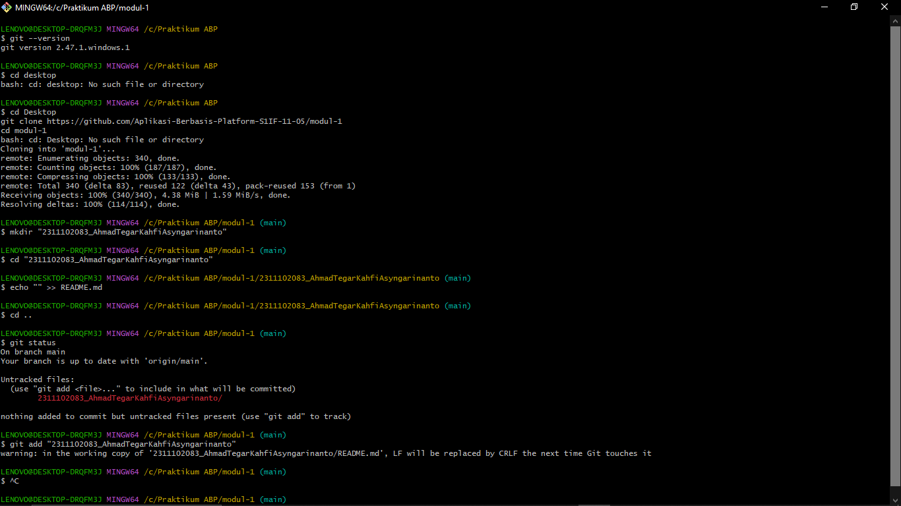

<div align="center">
  <br />
  <h1>LAPORAN PRAKTIKUM <br> APLIKASI BERBASIS PLATFORM </h1>
  <br />
  <h3>MODUL 1 <br> Instalasi dan GIT </h3>
  <br />
  
  <br />
  <br />
  <br />
  <h3>Disusun Oleh :</h3>
  <p>
    <strong>Ahmad Tegar Kahfi Asyngarinanto</strong>
    <br>
    <strong>2311102083</strong>
    <br>
    <strong>S1 IF-11-REG05</strong>
  </p>
  <br />
  <h3>Dosen Pengampu :</h3>
  <p>
    <strong>Dedi Agung Prabowo, S.Kom., M.Kom</strong>
  </p>
  <br />
  <br />
  <h4>Asisten Praktikum :</h4>
  <strong>Apri Pandu Wicaksono</strong>
  <br>
  <strong>Hamka Zaenul Ardi</strong>
  <br />
  <h3>LABORATORIUM HIGH PERFORMANCE <br>FAKULTAS INFORMATIKA <br>UNIVERSITAS TELKOM PURWOKERTO <br>2026 </h3>
</div>

<hr>

# Dasar Teori

## 1. Git

Git adalah sistem kontrol versi terdistribusi (*distributed version control system*) yang digunakan untuk melacak perubahan pada file atau kumpulan file dari waktu ke waktu. Git dikembangkan oleh Linus Torvalds pada tahun 2005 dan kini menjadi salah satu alat paling populer dalam pengembangan perangkat lunak.

Dengan Git, setiap developer memiliki salinan penuh dari seluruh riwayat proyek di komputer lokal mereka, sehingga memungkinkan pengembangan yang cepat, aman, dan dapat dilacak. Git mendukung alur kerja non-linear melalui cabang (*branching*) dan penggabungan (*merging*) yang sangat fleksibel.

**Konsep Utama Git:**
- **Repository (Repo):** Tempat penyimpanan proyek beserta seluruh riwayat perubahannya.
- **Commit:** Rekaman snapshot dari perubahan yang telah dilakukan.
- **Branch:** Cabang pengembangan yang memungkinkan pekerjaan paralel.
- **Staging Area:** Area antara di mana perubahan disiapkan sebelum di-commit.
- **Working Directory:** Direktori lokal tempat kita bekerja dan mengubah file.

**Perintah Dasar Git:**

| Perintah | Fungsi |
|----------|--------|
| `git init` | Menginisialisasi repositori Git baru |
| `git clone <url>` | Menyalin repositori dari remote |
| `git add <file>` | Menambahkan file ke staging area |
| `git commit -m "pesan"` | Menyimpan perubahan dengan pesan |
| `git push` | Mengirim commit ke remote repository |
| `git pull` | Mengambil dan menggabungkan perubahan dari remote |
| `git status` | Melihat status perubahan file |
| `git log` | Melihat riwayat commit |

---

## 2. GitHub

GitHub adalah platform hosting berbasis cloud untuk repositori Git. GitHub menyediakan antarmuka web yang memudahkan kolaborasi antar developer, manajemen proyek, dan penyimpanan kode sumber secara online. GitHub menggunakan Git sebagai sistem kontrol versi di baliknya.

**Fitur Utama GitHub:**
- **Repository:** Tempat menyimpan dan mengelola kode proyek secara online.
- **Commit History:** Melacak semua perubahan yang telah dilakukan pada kode.
- **Pull Request:** Mekanisme untuk mengajukan perubahan agar ditinjau dan digabungkan.
- **Issues:** Sistem pelacak bug dan diskusi fitur.
- **README.md:** File dokumentasi utama yang ditampilkan di halaman repository.

---

## 3. Hubungan Git dan GitHub

Git adalah *tool* yang berjalan di komputer lokal untuk mengelola versi file, sedangkan GitHub adalah layanan *cloud* yang menjadi tempat penyimpanan remote dari repositori Git. Keduanya bekerja bersama: Git digunakan untuk membuat dan mengelola commit secara lokal, lalu hasilnya di-*push* ke GitHub agar dapat diakses dan dibagikan kepada orang lain.

---

# Tugas 1

## Langkah-Langkah Upload Tugas ke GitHub via Git (Windows)

### Prasyarat
Sebelum memulai, pastikan Git sudah terpasang di komputer. Untuk memverifikasinya, buka **Git Bash** dan jalankan perintah berikut:
```
git --version
```
---

### Langkah 1 – Clone Repository Tugas

Buka **Git Bash**, lalu pindah ke direktori tempat kita ingin menyimpan project, kemudian clone repository mata kuliah:

```bash
cd "C:/Praktikum ABP"
git clone https://github.com/Aplikasi-Berbasis-Platform-S1IF-11-05/modul-1
cd modul-1
```

---

### Langkah 2 – Buat Folder Sesuai NIM dan Nama

Di dalam folder hasil clone, buat folder baru dengan format **NIM_NamaLengkap** tanpa spasi:

```bash
mkdir "2311102083_AhmadTegarKahfiAsyngarinanto"
```

---

### Langkah 3 – Masuk ke Folder yang Sudah Dibuat

```bash
cd "2311102083_AhmadTegarKahfiAsyngarinanto"
```

---

### Langkah 4 – Buat File README.md

Buat file README.md kosong terlebih dahulu menggunakan perintah berikut:

```bash
echo "" >> README.md
```

Setelah itu, buka file `README.md` menggunakan teks editor seperti VS Code atau Notepad, lalu isi dengan laporan praktikum sesuai format yang ditentukan.

---

### Langkah 5 – Buat Folder Assets dan Tambahkan Screenshot

Buat folder `Assets` untuk menyimpan file screenshot sebagai bukti pengerjaan:

```bash
mkdir Assets
```

Kemudian taruh file screenshot (misal `Bukti.png`) ke dalam folder `Assets` tersebut melalui Windows Explorer.

---

### Langkah 6 – Kembali ke Root Repository

Setelah semua file siap, kembali ke folder utama repository:

```bash
cd ..
```

---

### Langkah 7 – Cek Status Perubahan

Sebelum meng-upload, cek terlebih dahulu file apa saja yang sudah ditambahkan atau diubah:

```bash
git status
```

File dan folder baru akan muncul sebagai *untracked* yang artinya belum dilacak oleh Git.

---

### Langkah 8 – Tambahkan Perubahan ke Staging Area

Tambahkan seluruh isi folder ke staging area agar siap untuk di-commit:

```bash
git add .
```

---

### Langkah 9 – Commit Perubahan

Simpan perubahan dengan pesan yang menjelaskan isi commit:

```bash
git commit -m "Tugas Modul 1 - Instalasi & Git"
```

---

### Langkah 10 – Sinkronisasi dengan Repository Remote

Sebelum push, ambil dulu perubahan terbaru dari GitHub untuk menghindari konflik/eror

```bash
git pull --rebase
```

---

### Langkah 11 – Push ke GitHub

Kirim commit ke repository GitHub:

```bash
git push
```

---

### Langkah 12 – Verifikasi di GitHub

Buka browser dan kunjungi URL repository berikut:
```
https://github.com/Aplikasi-Berbasis-Platform-S1IF-11-05/modul-1
```
Pastikan folder `2311102083_AhmadTegarKahfiAsyngarinanto` beserta isinya sudah muncul dengan benar.

---

## Output

Output:


