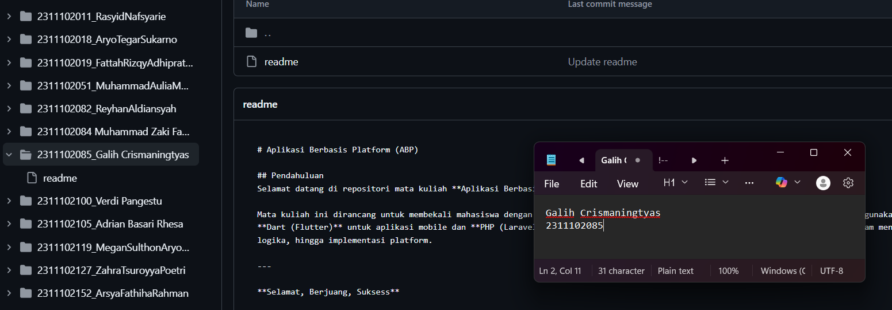

<div align="center">
  <br />
  <h1>LAPORAN PRAKTIKUM <br> APLIKASI BERBASIS PLATFORM </h1>
  <br />
  <h3>MODUL 1 <br> Instalasi dan GIT </h3>
  <br />
  
  <br />
  <br />
  <br />
  <h3>Disusun Oleh :</h3>
  <p>
    <strong>Galih Crismaningtyas</strong>
    <br>
    <strong>2311102084</strong>
    <br>
    <strong>S1 IF-11-REG05</strong>
  </p>
  <br />
  <h3>Dosen Pengampu :</h3>
  <p>
    <strong>Dedi Agung Prabowo, S.Kom., M.Kom</strong>
  </p>
  <br />
  <br />
  <h4>Asisten Praktikum :</h4>
  <strong>Apri Pandu Wicaksono </strong>
  <br>
  <strong>Hamka Zaenul Ardi</strong>
  <br />
  <h3>LABORATORIUM HIGH PERFORMANCE <br>FAKULTAS INFORMATIKA <br>UNIVERSITAS TELKOM PURWOKERTO <br>2026 </h3>
</div>

<hr>

# Dasar Teori

Git adalah sistem kontrol versi Version Control System yang digunakan untuk mengelola perubahan pada file atau kode program dalam suatu proyek. Dengan Git, setiap perubahan yang dilakukan pada kode akan tercatat sehingga pengembang dapat melihat riwayat perubahan, mengetahui siapa yang melakukan perubahan, serta mengembalikan file ke versi sebelumnya jika terjadi kesalahan. Git sangat membantu dalam proses pengembangan perangkat lunak karena memungkinkan pengelolaan kode yang lebih terstruktur dan aman. Sistem ini dikembangkan oleh Linus Torvalds pada tahun 2005 untuk mendukung pengembangan sistem operasi Linux.

Selain itu, Git juga mendukung kerja kolaboratif dalam tim pengembang. Beberapa orang dapat bekerja pada proyek yang sama secara bersamaan tanpa saling menimpa perubahan yang dibuat oleh anggota tim lainnya. Git biasanya digunakan bersama layanan penyimpanan repository online seperti GitHub, GitLab, dan Bitbucket yang memudahkan penyimpanan, berbagi, serta pengelolaan kode secara daring. Dengan adanya Git, proses pengembangan perangkat lunak menjadi lebih terorganisir, efisien, dan mudah dikelola.

# Tugas 1
```
//2311102084
//Galih Crismaningtyas

```
Output: 
 
</p>
