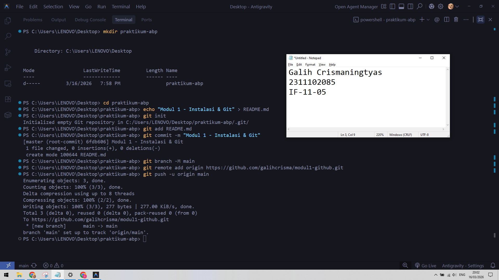

# Aplikasi Berbasis Platform (ABP)

## Pendahuluan
Selamat datang di repositori mata kuliah **Aplikasi Berbasis Platform** S1IF-11-05!

Mata kuliah ini dirancang untuk membekali mahasiswa dengan kemampuan membangun aplikasi yang efisien, skalabel, dan tangguh menggunakan bahasa pemrograman **Dart (Flutter)** untuk aplikasi mobile dan **PHP (Laravel)** untuk backend. Repositori ini akan menjadi panduan utama Anda dalam mengeksplorasi sintaksis, logika, hingga implementasi platform.

---

**Selamat, Berjuang, Suksess**

## Format Laporan Praktikum (README.md)

<div align="center">
  <br />
  <h1>LAPORAN PRAKTIKUM <br> APLIKASI BERBASIS PLATFORM </h1>
  <br />
  <h3>MODUL 1 <br> Instalasi dan GIT </h3>
  <br />
  
  <br />
  <br />
  <br />
  <h3>Disusun Oleh :</h3>
  <p>
    <strong>Galih Crismaningtyas</strong>
    <br>
    <strong>2311102085</strong>
    <br>
    <strong>S1 IF-11-REG05</strong>
  </p>
  <br />
  <h3>Dosen Pengampu :</h3>
  <p>
    <strong>Dedi Agung Prabowo, S.Kom., M.Kom</strong>
  </p>
  <br />
  <br />
  <h4>Asisten Praktikum :</h4>
  <strong>Apri Pandu Wicaksono </strong>
  <br>
  <strong>Hamka Zaenul Ardi</strong>
  <br />
  <h3>LABORATORIUM HIGH PERFORMANCE <br>FAKULTAS INFORMATIKA <br>UNIVERSITAS TELKOM PURWOKERTO <br>2026 </h3>
</div>

<hr>

# Dasar Teori

## Konsep Dasar dan Arsitektur Git
Git adalah sistem Distributed Version Control System (DVCS) yang berarti setiap pengembang memiliki salinan lengkap dari seluruh riwayat proyek di komputer lokal mereka, bukan hanya sekadar "checkout" file terbaru dari server pusat. Secara internal, Git tidak menyimpan perubahan baris demi baris seperti sistem lama (SVN), melainkan mengambil "snapshot" dari seluruh keadaan file pada saat itu. Jika sebuah file tidak berubah dalam sebuah commit, Git tidak menyimpan file itu lagi, melainkan hanya menyediakan tautan ke file identik sebelumnya yang sudah ia simpan. Hal ini membuat operasi Git seperti pembuatan branch atau pengecekan riwayat menjadi sangat cepat karena hampir semua data tersedia secara lokal tanpa perlu akses internet.

## Mekanisme Kerja: Tiga Area Utama
Dalam alur kerja praktisnya, Git membagi siklus hidup file ke dalam tiga area utama: Working Directory, Staging Area (Index), dan Git Directory (Repository).

Working Directory adalah tempat Anda melakukan modifikasi file secara nyata.

Staging Area bertindak sebagai zona penyangga atau "draft" tempat Anda menandai perubahan mana yang akan dimasukkan ke dalam riwayat berikutnya.

Git Directory adalah tempat Git menyimpan metadata dan database objek proyek Anda secara permanen setelah Anda melakukan commit.

# Tugas 1
```

```
Output:

