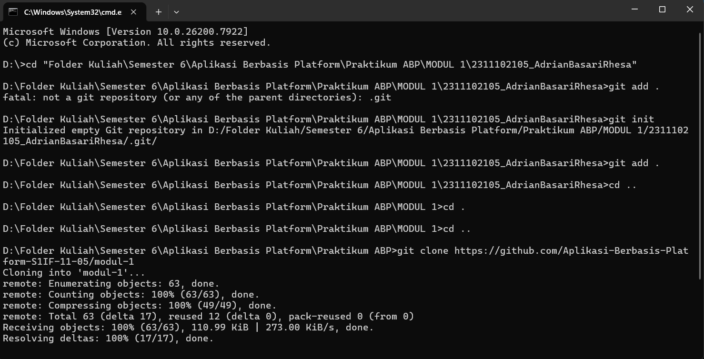

# MODUL 1

<div align="center">

# LAPORAN PRAKTIKUM
# APLIKASI BERBASIS PLATFORM

<hr>

### MODUL 1
### Instalasi dan GIT

<br>


<br><br>

**Disusun Oleh :**

**Adrian Basari Rhesa**<br>
**2311102105**<br>
**S1 IF-11-REG05**

<br>

**Dosen Pengampu :**

**Dedi Agung Prabowo, S.Kom., M.Kom**

</div>

## Dasar Teori

Modul Praktikum 1 & 2

<br>

## Tugas 1 - Instalasi dan GIT

```bash
// 2311102105
// Adrian Basari Rhesa

// Proses Pengerjaan Tugas
// 1. Pastikan aplikasi Git sudah ter-install di laptop/komputer.
// 2. Siapkan folder penyimpanan bernama "Praktikum ABP" di dalam Local Disk D.
// 3. Jalankan CMD, lalu arahkan path direktori menuju folder "Praktikum ABP" tersebut.
// 4. Unduh repository Modul 1 dari GitHub menggunakan command git clone.
// 5. Pindah ke dalam direktori repository dengan perintah "cd modul-1".
// 6. Buat direktori pengumpulan tugas dengan "mkdir 2311102105_AdrianBasariRhesa", lalu masuk ke dalamnya pakai "cd 2311102105_AdrianBasariRhesa".
// 7. Buat file untuk laporan dengan mengeksekusi "echo # Modul 1 > README.md".
// 8. Ketik "code ." di CMD agar folder langsung otomatis terbuka di VS Code.
// 9. Jika pengerjaan laporan dan tugas sudah beres, mundur satu folder ke repo utama dengan "cd ..".
// 10. Siapkan file untuk di-upload ke GitHub dengan menjalankan "git add .".
// 11. Beri keterangan pada update tugas menggunakan "git commit -m \"Tugas Modul 1\"".
// 12. Lakukan sinkronisasi data dengan server menggunakan "git pull --rebase origin main".
// 13. Unggah file tugas ke branch main dengan perintah "git push origin main".
// 14. Selesai!
```
### HASIL SCREENSHOOT


