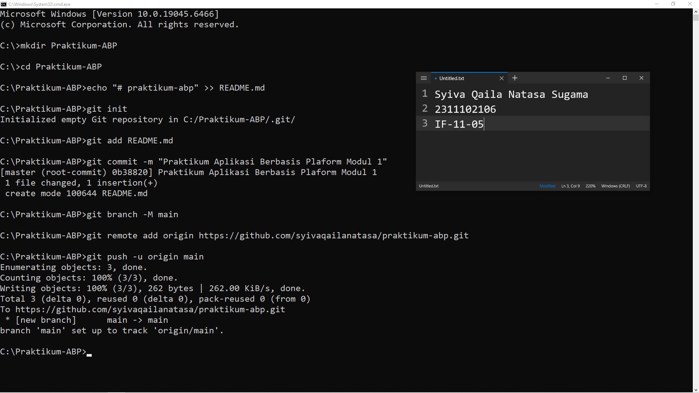

# Aplikasi Berbasis Platform (ABP)

## Pendahuluan
Selamat datang di repositori mata kuliah **Aplikasi Berbasis Platform** S1IF-11-05!

Mata kuliah ini dirancang untuk membekali mahasiswa dengan kemampuan membangun aplikasi yang efisien, skalabel, dan tangguh menggunakan bahasa pemrograman **Dart (Flutter)** untuk aplikasi mobile dan **PHP (Laravel)** untuk backend. Repositori ini akan menjadi panduan utama Anda dalam mengeksplorasi sintaksis, logika, hingga implementasi platform.

---

**Selamat, Berjuang, Suksess**

## Format Laporan Praktikum (README.md)

<div align="center">
  <br />
  <h1>LAPORAN PRAKTIKUM <br> APLIKASI BERBASIS PLATFORM </h1>
  <br />
  <h3>MODUL 1 <br> Instalasi dan GIT </h3>
  <br />
  
  <br />
  <br />
  <br />
  <h3>Disusun Oleh :</h3>
  <p>
    <strong>Syiva Qaila Natasa Sugama</strong>
    <br>
    <strong>2311102106</strong>
    <br>
    <strong>S1 IF-11-REG05</strong>
  </p>
  <br />
  <h3>Dosen Pengampu :</h3>
  <p>
    <strong>Dedi Agung Prabowo, S.Kom., M.Kom</strong>
  </p>
  <br />
  <br />
  <h4>Asisten Praktikum :</h4>
  <strong>Apri Pandu Wicaksono </strong>
  <br>
  <strong>Hamka Zaenul Ardi</strong>
  <br />
  <h3>LABORATORIUM HIGH PERFORMANCE <br>FAKULTAS INFORMATIKA <br>UNIVERSITAS TELKOM PURWOKERTO <br>2026 </h3>
</div>

<hr>

# Dasar Teori

Git merupakan sistem kontrol versi terdistribusi (Distributed Version Control System) yang dirancang untuk melacak perubahan pada sekumpulan berkas, khususnya dalam pengembangan perangkat lunak. Berbeda dengan sistem terpusat, Git memungkinkan setiap pengembang memiliki salinan lengkap dari seluruh riwayat proyek di komputer lokal mereka. Hal ini memberikan fleksibilitas tinggi karena operasi seperti melihat riwayat, melakukan komit, dan pembuatan cabang (branching) dapat dilakukan secara luring (offline) tanpa bergantung pada server pusat, sehingga meningkatkan kecepatan dan keamanan data melalui redundansi penuh di setiap node pengembang.

Secara teknis, Git bekerja dengan mengelola tiga area utama dalam siklus hidup berkas: working directory untuk modifikasi langsung, staging area sebagai tempat penampungan sementara, dan repository sebagai tempat penyimpanan permanen riwayat perubahan. Melalui mekanisme ini, pengembang dapat mengelompokkan perubahan secara logis sebelum menyimpannya ke dalam basis data Git menggunakan perintah commit. Kemampuan Git dalam menangani percabangan secara efisien juga mendukung kolaborasi tim yang kompleks, di mana fitur-fitur baru dapat dikembangkan secara terisolasi tanpa mengganggu jalur utama kode (main branch), sebelum akhirnya digabungkan kembali melalui proses merging.


# Tugas 1
```

```
Output:

