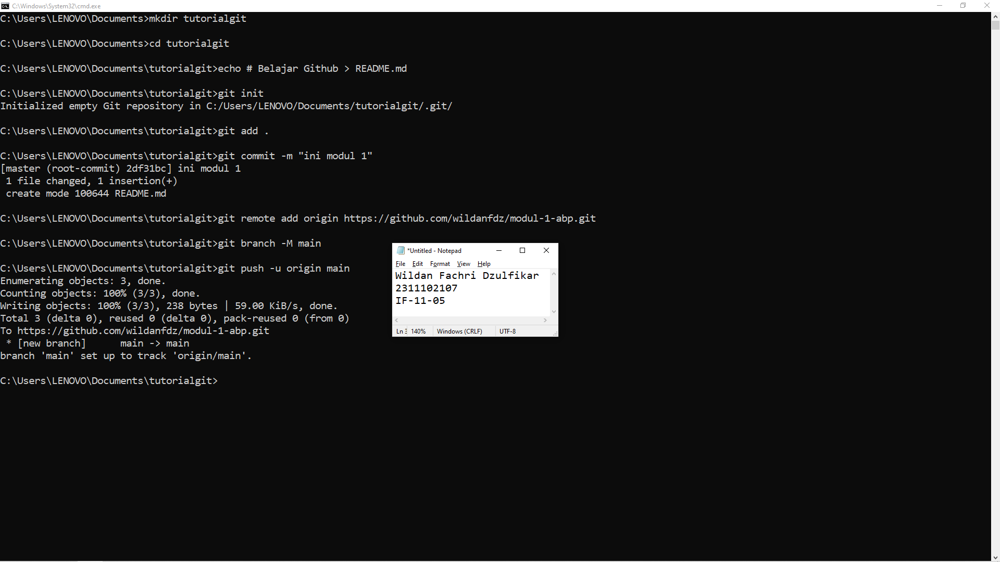

# Aplikasi Berbasis Platform (ABP)

## Pendahuluan
Selamat datang di repositori mata kuliah **Aplikasi Berbasis Platform** S1IF-11-05!

Mata kuliah ini dirancang untuk membekali mahasiswa dengan kemampuan membangun aplikasi yang efisien, skalabel, dan tangguh menggunakan bahasa pemrograman **Dart (Flutter)** untuk aplikasi mobile dan **PHP (Laravel)** untuk backend. Repositori ini akan menjadi panduan utama Anda dalam mengeksplorasi sintaksis, logika, hingga implementasi platform.

---

**Selamat, Berjuang, Suksess**

## Format Laporan Praktikum (README.md)

<div align="center">
  <br />
  <h1>LAPORAN PRAKTIKUM <br> APLIKASI BERBASIS PLATFORM </h1>
  <br />
  <h3>MODUL 1 <br> Instalasi dan GIT </h3>
  <br />
  
  <br />
  <br />
  <br />
  <h3>Disusun Oleh :</h3>
  <p>
    <strong>Wildan Fachri Dzulfikar</strong>
    <br>
    <strong>2311102107</strong>
    <br>
    <strong>S1 IF-11-REG05</strong>
  </p>
  <br />
  <h3>Dosen Pengampu :</h3>
  <p>
    <strong>Dedi Agung Prabowo, S.Kom., M.Kom</strong>
  </p>
  <br />
  <br />
  <h4>Asisten Praktikum :</h4>
  <strong>Apri Pandu Wicaksono </strong>
  <br>
  <strong>Hamka Zaenul Ardi</strong>
  <br />
  <h3>LABORATORIUM HIGH PERFORMANCE <br>FAKULTAS INFORMATIKA <br>UNIVERSITAS TELKOM PURWOKERTO <br>2026 </h3>
</div>

<hr>

# Dasar Teori

Git adalah sistem version control yang digunakan untuk melacak perubahan pada file atau kode program selama proses pengembangan. git memungkinkan banyak pengembang bekerja pada proyek yang sama tanpa saling menimpa perubahan yang dibuat oleh orang lain.

git pertama kali dikembangkan oleh Linus Torvalds pada tahun 2005 untuk membantu pengembangan sistem operasi Linux.

fungsi git

git memiliki beberapa fungsi utama, yaitu:

1. melacak perubahan file dalam suatu proyek.

2. menyimpan riwayat versi dari setiap perubahan yang dilakukan.

3. memudahkan kolaborasi antara beberapa pengembang dalam satu proyek.

4. mengembalikan file ke versi sebelumnya jika terjadi kesalahan.

dalam git terdapat beberapa konsep dasar yang penting, antara lain:

## repository
tempat penyimpanan seluruh file dan riwayat perubahan dalam sebuah proyek.

## commit
proses menyimpan perubahan yang telah dilakukan pada file ke dalam repository.

## branch
cabang pengembangan yang memungkinkan developer mengerjakan fitur baru tanpa mengganggu kode utama.

## merge
proses menggabungkan perubahan dari satu branch ke branch lainnya.

# Tugas 1
```

```
Output:

