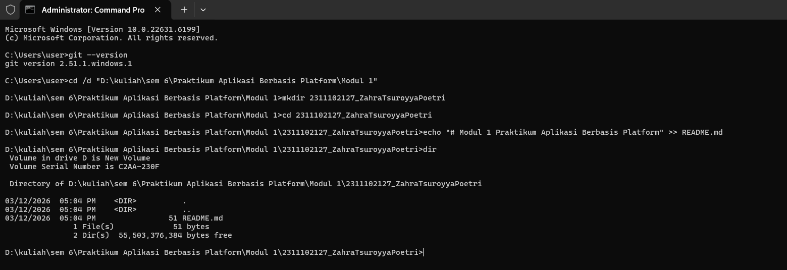

# Aplikasi Berbasis Platform (ABP)

## Pendahuluan
Selamat datang di repositori mata kuliah **Aplikasi Berbasis Platform** S1IF-11-05!

Mata kuliah ini dirancang untuk membekali mahasiswa dengan kemampuan membangun aplikasi yang efisien, skalabel, dan tangguh menggunakan bahasa pemrograman **Dart (Flutter)** untuk aplikasi mobile dan **PHP (Laravel)** untuk backend. Repositori ini akan menjadi panduan utama Anda dalam mengeksplorasi sintaksis, logika, hingga implementasi platform.

---

**Selamat, Berjuang, Suksess**

## Format Laporan Praktikum (README.md)

<div align="center">
  <br />
  <h1>LAPORAN PRAKTIKUM <br> APLIKASI BERBASIS PLATFORM </h1>
  <br />
  <h3>MODUL 1 <br> Instalasi dan GIT </h3>
  <br />
  
  <br />
  <br />
  <br />
  <h3>Disusun Oleh :</h3>
  <p>
    <strong>Zahra Tsuroyya Poetri</strong>
    <br>
    <strong>2311102128</strong>
    <br>
    <strong>S1 IF-11-REG05</strong>
  </p>
  <br />
  <h3>Dosen Pengampu :</h3>
  <p>
    <strong>Dedi Agung Prabowo, S.Kom., M.Kom</strong>
  </p>
  <br />
  <br />
  <h4>Asisten Praktikum :</h4>
  <strong>Apri Pandu Wicaksono </strong>
  <br>
  <strong>Hamka Zaenul Ardi</strong>
  <br />
  <h3>LABORATORIUM HIGH PERFORMANCE <br>FAKULTAS INFORMATIKA <br>UNIVERSITAS TELKOM PURWOKERTO <br>2026 </h3>
</div>

<hr>

# Dasar Teori

Git adalah salah satu sistem pengontrol versi (Version Control System) pada proyek perangkat lunak yang
diciptakan oleh Linus Torvalds. Pengontrol versi bertugas mencatat setiap perubahan pada file proyek yang
dikerjakan oleh banyak orang maupun sendiri. Git dikenal juga dengan distributed revision control (VCS
terdistribusi), artinya penyimpanan database Git tidak hanya berada dalam satu tempat saja.

# Tugas 1 Instalasi & Git
```
//2311102127
//Zahra Tsuroyya Poetri

# Modul 1 Praktikum Aplikasi Berbasis Platform

// 2311102127
// Zahra Tsuroyya Poetri

// Proses Pengerjaan Tugas
// 1. Memastikan aplikasi Git sudah ter-install di laptop/komputer dengan menjalankan perintah "git --version" pada CMD.
// 2. Menyiapkan folder penyimpanan praktikum pada Local Disk D dengan path:
//    D:\kuliah\sem 6\Praktikum Aplikasi Berbasis Platform\Modul 1
// 3. Membuka Command Prompt (CMD) kemudian mengarahkan direktori ke folder tersebut menggunakan perintah:
//    cd /d "D:\kuliah\sem 6\Praktikum Aplikasi Berbasis Platform\Modul 1"
// 4. Membuat folder pengumpulan tugas dengan format NIM_Nama menggunakan perintah:
//    mkdir "2311102127_Zahra Tsuroyya Poetri"
// 5. Masuk ke dalam folder yang telah dibuat dengan perintah:
//    cd "2311102127_Zahra Tsuroyya Poetri"
// 6. Membuat file laporan praktikum dalam format Markdown menggunakan perintah:
//    echo "# Modul 1 Praktikum Aplikasi Berbasis Platform" >> README.md
// 7. Mengecek file yang sudah dibuat dengan menjalankan perintah:
//    dir
// 8. Membuka folder tersebut menggunakan Visual Studio Code untuk mengedit isi laporan praktikum.
// 9. Setelah laporan selesai dikerjakan, file README.md siap untuk diunggah ke repository GitHub sesuai ketentuan praktikum.
// 10. Selesai.

```
Hasil Screenshot:

