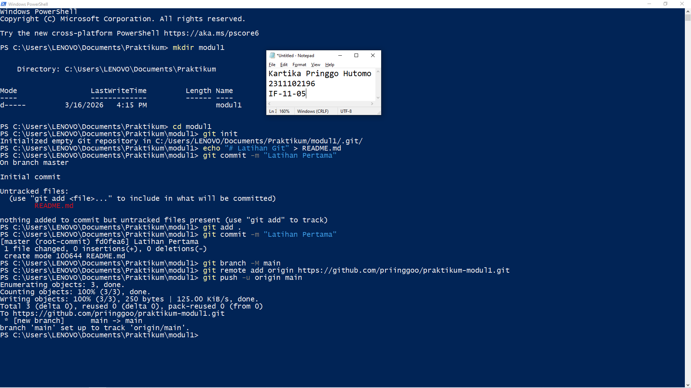

# Aplikasi Berbasis Platform (ABP)

## Pendahuluan
Selamat datang di repositori mata kuliah **Aplikasi Berbasis Platform** S1IF-11-05!

Mata kuliah ini dirancang untuk membekali mahasiswa dengan kemampuan membangun aplikasi yang efisien, skalabel, dan tangguh menggunakan bahasa pemrograman **Dart (Flutter)** untuk aplikasi mobile dan **PHP (Laravel)** untuk backend. Repositori ini akan menjadi panduan utama Anda dalam mengeksplorasi sintaksis, logika, hingga implementasi platform.

---

**Selamat, Berjuang, Suksess**

## Format Laporan Praktikum (README.md)

<div align="center">
  <br />
  <h1>LAPORAN PRAKTIKUM <br> APLIKASI BERBASIS PLATFORM </h1>
  <br />
  <h3>MODUL 1 <br> Instalasi dan GIT </h3>
  <br />
  
  <br />
  <br />
  <br />
  <h3>Disusun Oleh :</h3>
  <p>
    <strong>Kartika Pringgo Hutomo</strong>
    <br>
    <strong>2311102196</strong>
    <br>
    <strong>S1 IF-11-REG05</strong>
  </p>
  <br />
  <h3>Dosen Pengampu :</h3>
  <p>
    <strong>Dedi Agung Prabowo, S.Kom., M.Kom</strong>
  </p>
  <br />
  <br />
  <h4>Asisten Praktikum :</h4>
  <strong>Apri Pandu Wicaksono </strong>
  <br>
  <strong>Hamka Zaenul Ardi</strong>
  <br />
  <h3>LABORATORIUM HIGH PERFORMANCE <br>FAKULTAS INFORMATIKA <br>UNIVERSITAS TELKOM PURWOKERTO <br>2026 </h3>
</div>

<hr>

# Dasar Teori

## 1. Version Control System (VCS)
Version Control System adalah sebuah sistem yang mencatat setiap perubahan pada berkas dari waktu ke waktu sehingga pengguna dapat meninjau kembali versi spesifik di masa lalu. Dalam pengembangan perangkat lunak, VCS sangat krusial untuk:

Melacak sejarah perubahan kode.

Memungkinkan kolaborasi antar pengembang tanpa menimpa pekerjaan satu sama lain.

Menyediakan mekanisme rollback jika terjadi kesalahan (bug) pada versi terbaru.

## 2. Git vs. GitHub
Penting untuk membedakan antara Git sebagai alat (tool) dan GitHub sebagai layanan (service):

Git: Merupakan sistem kontrol versi terdistribusi (Distributed VCS) yang berjalan secara lokal di komputer pengembang. Git diciptakan oleh Linus Torvalds pada tahun 2005.

GitHub: Adalah platform berbasis cloud yang menyediakan layanan hosting untuk repositori Git. GitHub menambahkan fitur sosial dan kolaborasi seperti manajemen proyek, pelacakan masalah (issue tracking), dan pull requests.

## 3. Alur Kerja Dasar Git (Git Workflow)
Bekerja dengan Git melibatkan tiga area utama:

Working Directory: Tempat di mana berkas proyek berada dan dimodifikasi secara aktif.

Staging Area (Index): Sebuah "area tunggu" di mana perubahan ditandai untuk dimasukkan ke dalam komit (commit) berikutnya.

Repository (Local & Remote): Tempat penyimpanan permanen riwayat perubahan.

## 4. Konsep Branching dan Merging
Salah satu kekuatan GitHub adalah fitur Branching (percabangan). Branch memungkinkan pengembang untuk keluar dari jalur utama (main) guna mengerjakan fitur baru atau memperbaiki bug secara terisolasi. Setelah selesai, perubahan tersebut akan digabungkan kembali ke jalur utama melalui proses Merging.

## 5. Pull Request (PR)
Pull Request adalah fitur khas GitHub yang memungkinkan pengembang memberitahu anggota tim lain tentang perubahan yang telah mereka dorong (push) ke repositori. Ini adalah ruang untuk peninjauan kode (code review) dan diskusi sebelum kode benar-benar digabungkan ke proyek utama.

# Tugas 1
```

```
Output:

