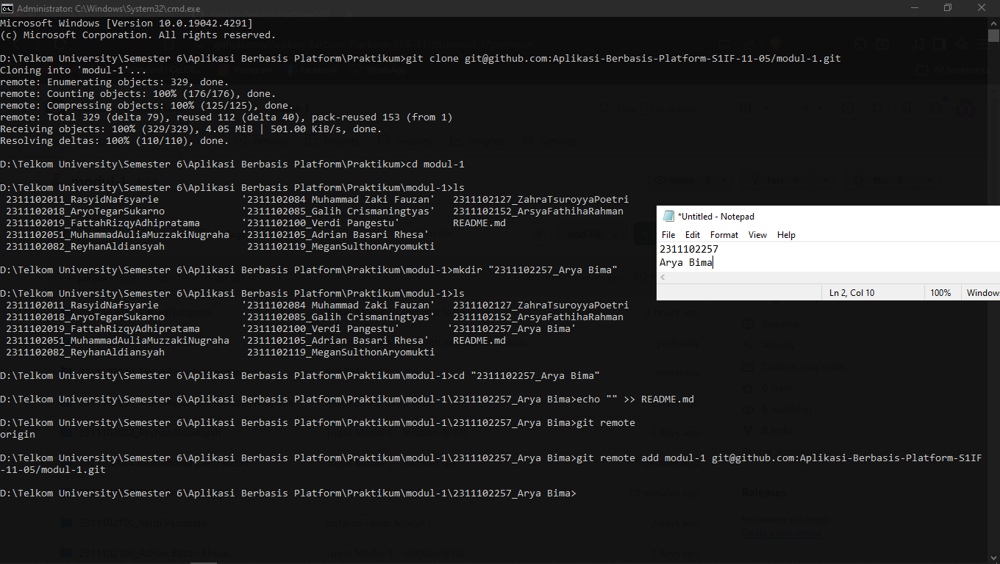

<div align="center">
  <br />
  <h1>LAPORAN PRAKTIKUM <br> APLIKASI BERBASIS PLATFORM </h1>
  <br />
  <h3>MODUL 1 <br> Instalasi dan GIT </h3>
  <br />
  
  <br />
  <br />
  <br />
  <h3>Disusun Oleh :</h3>
  <p>
    <strong>Arya Bima</strong>
    <br>
    <strong>2311102257</strong>
    <br>
    <strong>S1 IF-11-REG05</strong>
  </p>
  <br />
  <h3>Dosen Pengampu :</h3>
  <p>
    <strong>Dedi Agung Prabowo, S.Kom., M.Kom</strong>
  </p>
  <br />
  <br />
  <h4>Asisten Praktikum :</h4>
  <strong>Apri Pandu Wicaksono </strong>
  <br>
  <strong>Hamka Zaenul Ardi</strong>
  <br />
  <h3>LABORATORIUM HIGH PERFORMANCE <br>FAKULTAS INFORMATIKA <br>UNIVERSITAS TELKOM PURWOKERTO <br>2026 </h3>
</div>

<hr>

# Dasar Teori

### 1. Pengertian Version Control System (VCS)

Version Control System (VCS) adalah perangkat lunak yang digunakan untuk mencatat semua perubahan pada file-file proyek secara sistematis. Dengan VCS, tim pengembang dapat:

- Kembali ke versi sebelumnya kapan saja (rollback).
- Melihat riwayat perubahan (history).
- Bekerja secara kolaboratif tanpa menimpa pekerjaan orang lain.
- Mengelola branching dan merging dengan aman.

Ada dua jenis utama VCS:

- Centralized VCS (contoh: SVN, CVS) = semua data disimpan di satu server.
- Distributed VCS (contoh: Git, Mercurial) = setiap developer memiliki salinan lengkap repository (full history).

### 2. Apa Itu Git?

Git adalah Distributed Version Control System yang paling populer saat ini. Git dikembangkan oleh Linus Torvalds pada tahun 2005 untuk mengelola kode sumber kernel Linux. Karakteristik utama Git:

- Cepat - hampir semua operasi dilakukan secara lokal.
- Aman - setiap commit memiliki checksum (SHA-1).
- Branching ringan - membuat branch sangat cepat dan murah.
- Tidak bergantung pada server - bisa bekerja offline.

### 3. Arsitektur Git (Three States of Git)

Git mengelola file dalam tiga area utama:

1. Working Directory (Working Tree)  
   Tempat Anda mengedit file secara langsung.

2. Staging Area (Index)  
   Area “persiapan” sebelum commit. File yang sudah `git add` masuk ke sini.

3. Repository (HEAD)  
   Database permanen yang menyimpan semua commit.

### 4. Konsep-Konsep Penting Git

| Konsep       | Penjelasan                                                          | Contoh Perintah              |
| ------------ | ------------------------------------------------------------------- | ---------------------------- |
| Repository   | Folder proyek yang dikelola Git (.git)                              | `git init`, `git clone`      |
| Commit       | Snapshot permanen dari perubahan (seperti “save point”)             | `git commit -m "pesan"`      |
| Branch       | Cabang paralel untuk pengembangan (master/main adalah branch utama) | `git branch`, `git checkout` |
| HEAD         | Pointer yang menunjuk ke commit terakhir pada branch aktif          | -                            |
| Remote       | Repository di server (GitHub, GitLab, Bitbucket)                    | `git remote add origin`      |
| Merge        | Menggabungkan perubahan dari satu branch ke branch lain             | `git merge`                  |
| Pull Request | Cara kolaborasi modern (di GitHub/GitLab)                           | -                            |

### 5. Workflow Git Dasar (Standar Industri)

1. Inisialisasi / Clone  
   `git init` atau `git clone <url>`

2. Modifikasi & Staging  
   `git status` - `git add <file>` atau `git add .`

3. Commit  
   `git commit -m "deskripsi perubahan"`

4. Sinkronisasi dengan Remote  
   `git pull` - `git push`

5. Branching Workflow (Git Flow / GitHub Flow)
   - Buat branch fitur: `git checkout -b feature/login`
   - Kerjakan - commit
   - Merge ke main setelah review

### 6. File Pendukung Penting

- .gitignore - daftar file/folder yang tidak boleh di-track Git  
  Contoh isi:
  ```
  node_modules/
  *.log
  .env
  ```

# Tugas 1

Output:

