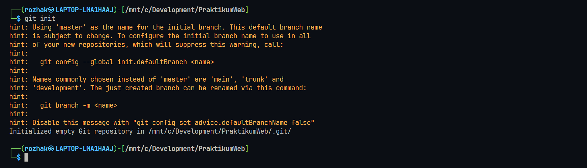
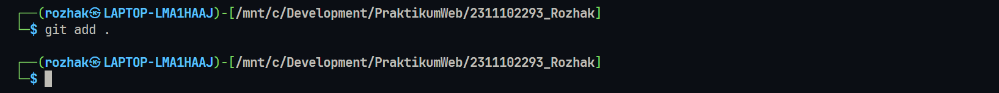
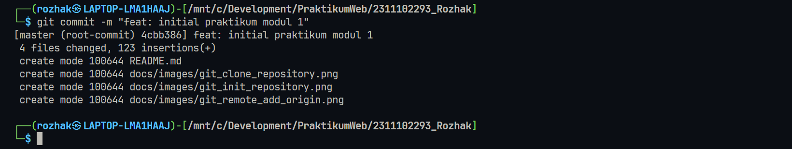
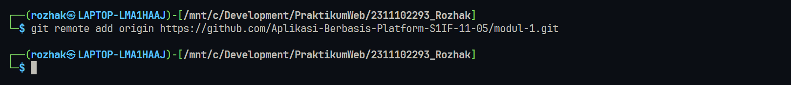
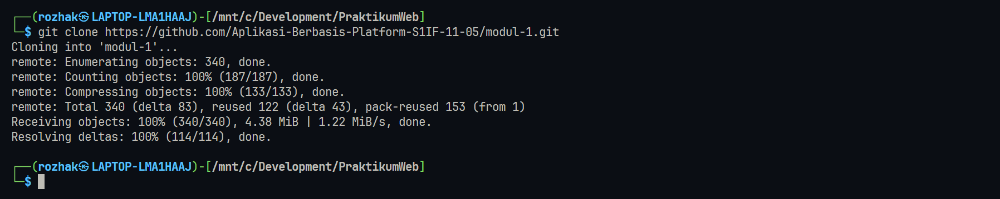
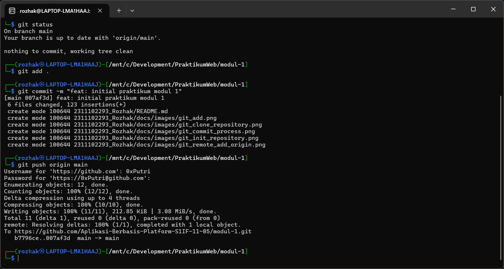

<div align="center">
    <br />
    <h1>LAPORAN PRAKTIKUM <br> APLIKASI BERBASIS PLATFORM </h1>
    <br />
    <h3>MODUL 1 <br> Instalasi dan GIT </h3>
    <br />
    
    <br />
    <br />
    <br />
    <h3>Disusun Oleh :</h3>
    <p>
        <strong>Rozhak</strong>
        <br>
        <strong>2311102293</strong>
        <br>
        <strong>S1 IF-11-REG05</strong>
    </p>
    <br />
    <h3>Dosen Pengampu :</h3>
    <p>
        <strong>Dedi Agung Prabowo, S.Kom., M.Kom</strong>
    </p>
    <br />
    <br />
    <h4>Asisten Praktikum :</h4>
    <strong>Apri Pandu Wicaksono </strong>
    <br>
    <strong>Hamka Zaenul Ardi</strong>
    <br />
    <h3>LABORATORIUM HIGH PERFORMANCE <br>FAKULTAS INFORMATIKA <br>UNIVERSITAS TELKOM PURWOKERTO <br>2026 </h3>
</div>
<hr>

## Dasar Teori

Git merupakan **Version Control System** yang digunakan untuk mencatat dan mengelola perubahan pada file dalam sebuah proyek perangkat lunak. Dengan Git, setiap perubahan kode dapat dilacak sehingga memudahkan pengelolaan versi, kolaborasi tim, serta pengembalian ke versi sebelumnya jika terjadi kesalahan. Git dikembangkan oleh _Linus Torvalds_ dan menggunakan konsep **distributed version control**, yaitu setiap pengguna memiliki salinan lengkap dari repository berserta perubahannya.

Dalam penggunaan git terdapat beberapa konsep dasar yang perlu dipahami:

### 1. Repository

Repository adalah tempat penyimpanan seluruh file proyek berserta riwayat perubahannya. Repository dapat bersifat **lokal** maupun **remote**. Repository lokal biasanya dibuat menggunakan perintah:

```bash
git init
```



Perintah tersebut akan membuat sebuah direktoru tersembunyi `.git` yang berisi database perubahan proyek.

### 2. Staging Area

Staging area adalah area sementara untuk menyiapkan perubahan sebelum disimpan ke repository. File yang telah dimodifikasi harus ditambahkan ke staging area menggunakan perintah:

```bash
git add .
```



Langkah ini memungkinkan kita menyimpan semua perubahan yang akan disimpan dalam satu commit.

### 3. Commit

Commit adalah sebuah proses menyimpan perubahan yang telah berada pada staging area ke dalam repository Git. Setiap commit memiliki **identitas unik dan pesan commit** yang menjelaskan perubahan yang telah dilakukan.

```bash
git commit -m "feat: initial praktikum modul 1"
```



Commit berfungsi sebagai titik riwayat yang memungkinkan pengembang melacak perkembangan proyek.

### 4. Remote Repository

Remote repository merupakan repository yang berada pada server atau layanan hosting seperti _Github_. Repository lokal dapat dihubungkan dengan repository remote menggunakan perintah:

```bash
git remote add origin https://github.com/Aplikasi-Berbasis-Platform-S1IF-11-05/modul-1.git
```



Setelah terhubung, perubahan dari repository lokal dapat dikirim ke remote menggunakan perintah `git push`.

### 5. Clone Repository

Clone digunakan untuk menyalin repository dari remote ke komputer lokal. Dengan clone, seluruh riwayat peoyek juga akan ikut disalin.

```bash
git clone https://github.com/Aplikasi-Berbasis-Platform-S1IF-11-05/modul-1.git
```



Fitur ini memungkinkan kolaborasi antar pengembang dalam satu proyek yang sama.

## Tugas 1

### Task 1: Pemanasan Terminal

Pada tugas ini dilakukan proses setup repository menggunakan **Command Line Interface**. Tujuannya adalah membiasakan penggunaan perintah terminal dalam pengelolaan repository Git seperti proses clone, penambahan file, commit, dan push ke repository remote.

Repository praktikum yang digunakan:

```text
https://github.com/Aplikasi-Berbasis-Platform-S1IF-11-05/modul-1
```

Proses dimulai dengan melakukan **clone repositori** dari Github ke komputer lokal menggunakan perintah `git clone`. Setelah repository berhasil diunduh, dilakukan perpindahan direktori ke folder project menggunakan perintah `cd`.   

Selanjutnya dilakukan pengecekan kondisi repository menggunakan `git status`, kemudian menambahkan perubahan ke staging area dengan `git add`, lalu menyimpan perubahan menggunakan `git commit`, dan terakhir mengirimkan hasil commit ke repository Github menggunakan `git push`.

Dokumentasi proses mulai dari `clone repository hingga push ke Github` ditunjukkan pada gambar berikut:



## Kesimpulan

Penggunaan Git melalui Command Line Interface (CLI) memungkinkan pengelolaan repository secara terukur, mulai dari proses clone, commit, hingga push ke repository remote.